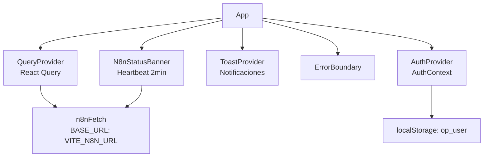
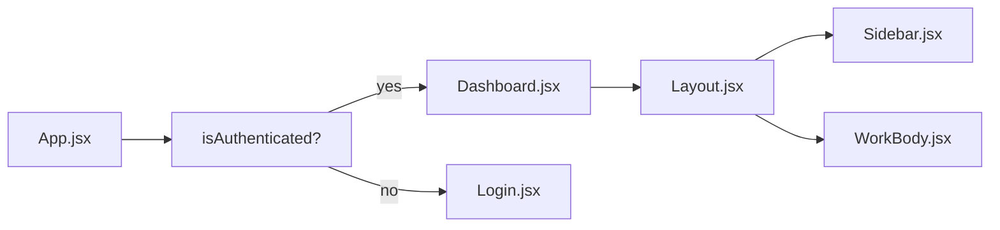
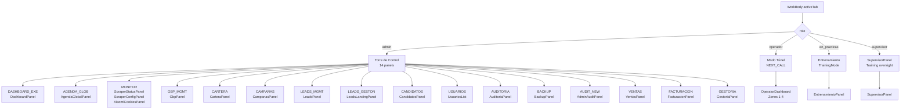
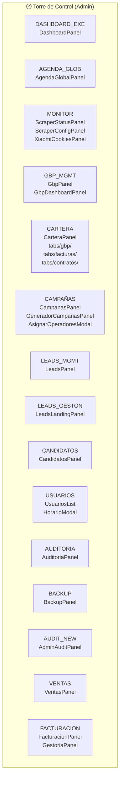
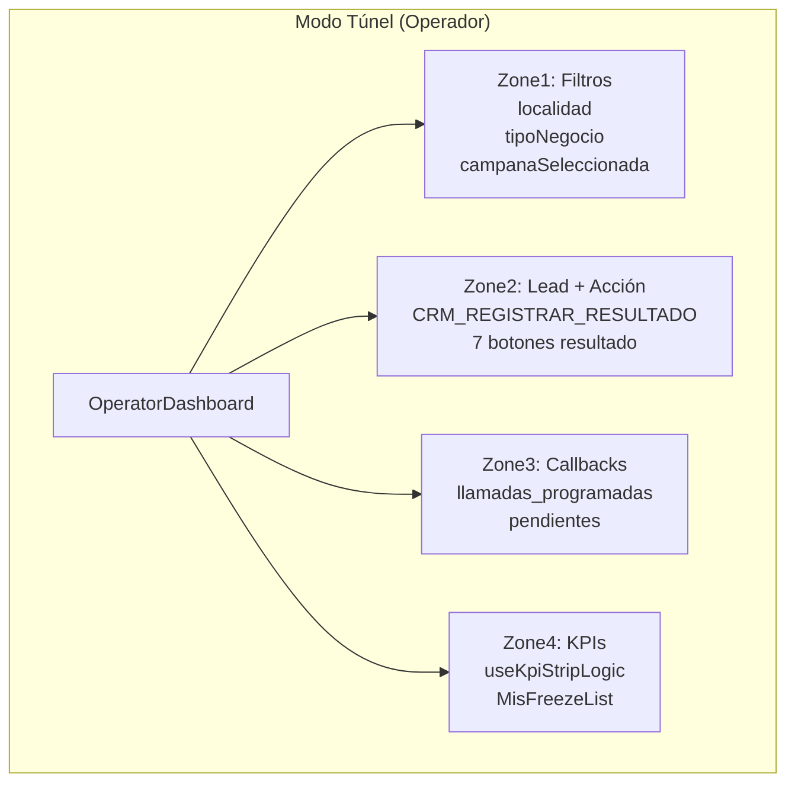
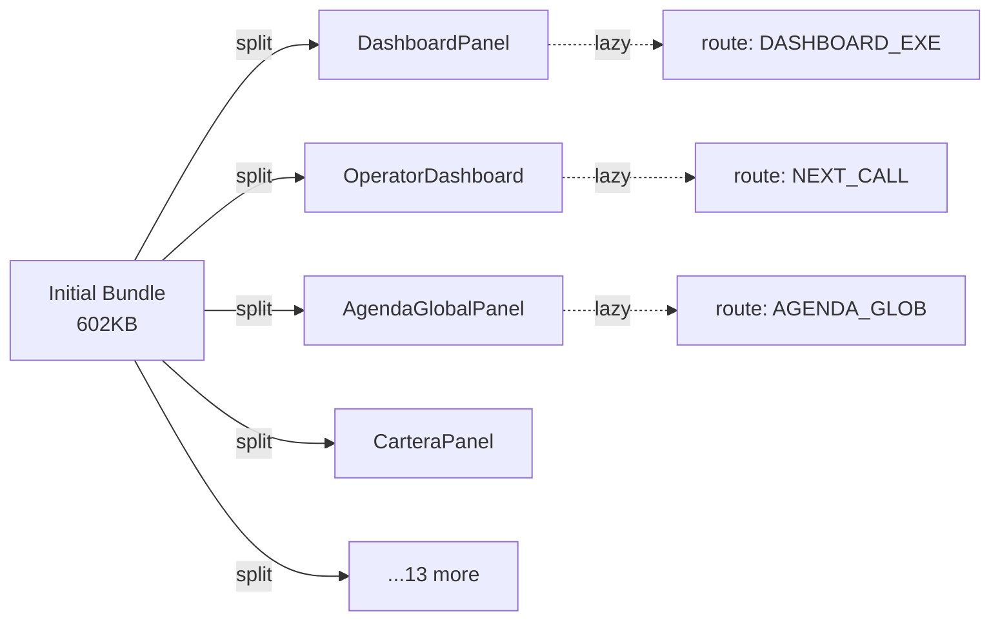
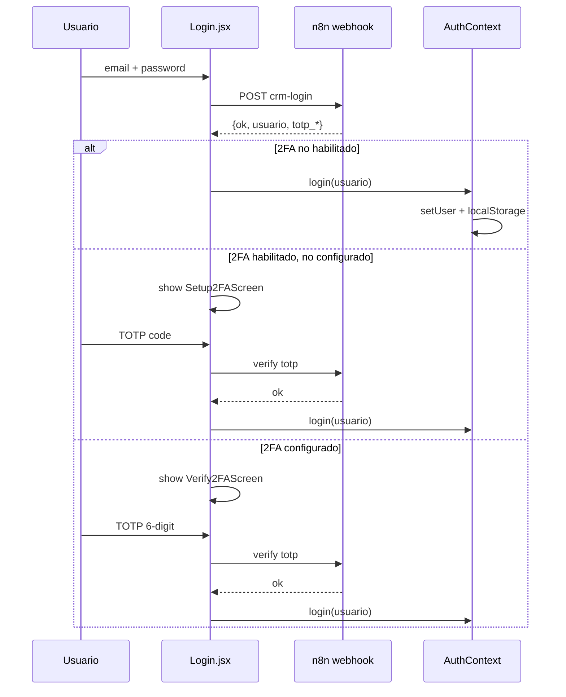

# Diagrama 3: Jerarquía Frontend React

**Stack**: React 19 + React Compiler + Vite 7 + Tailwind CSS v4  
**Routing**: Tab-based SPA (NO React Router)  
**State**: React Query + AuthContext  
**Auth**: 2FA TOTP vía n8n webhook

## Arquitectura de Providers (App.jsx)



## Componentes Raíz



## Routing por Rol (WorkBody.jsx)



## Torre de Control — 14 Paneles Admin



## Modo Túnel — 4 Zonas (OperatorDashboard)



## Hooks Clave

| Hook | Archivo | Uso |
|------|---------|-----|
| `useN8n` | `shared/hooks/useN8n.js` | n8nGet/n8nPost, 12s timeout, 1 retry |
| `useN8nQuery` | `shared/hooks/useN8n.js` | React Query GET |
| `useN8nMutation` | `shared/hooks/useN8n.js` | React Query POST |
| `useAuth` | `modules/auth/AuthContext.jsx` | user, login, logout, registerActivity |
| `useRbac` | `shared/auth/useRbac.js` | can(permission), permisos |
| `useOperatorData` | `hooks/useOperatorData.js` | Datos operador |
| `n8nHealthCheck` | `shared/hooks/useN8n.js` | Heartbeat n8n, 5s timeout |

## Lazy Loading (Code Splitting)



## Auth Flow



## Roles y Permisos

| Rol | Panels Accesibles |
|-----|-------------------|
| admin | Torre de Control (14 panels) + Modo Túnel |
| supervisor | Training oversight + Modo Túnel |
| operador | Modo Túnel (NEXT_CALL) |
| en_practicas | Entrenamiento + Modo Túnel limitado |

## Navegación Tab-Based (NO React Router)

```javascript
// WorkBody.jsx — tab-based routing
const tabs = {
  DASHBOARD_EXE: DashboardPanel,
  AGENDA_GLOB: AgendaGlobalPanel,
  NEXT_CALL: OperatorDashboard,
  MONITOR: <ScraperStatusPanel /> + <ScraperConfigPanel />,
  // ... 14+ more
};

// activeTab string → conditional render
{activeTab === 'DASHBOARD_EXE' && <DashboardPanel />}
{activeTab === 'NEXT_CALL' && <OperatorDashboard />}
```

## Anti-patterns Frontend (NO hacer)

- ❌ console.log en producción → usar `console.warn` o logger wrapper
- ❌ setTimeout sin clearTimeout → usar refs
- ❌ Spinners circulares → usar Skeleton screens
- ❌ rounded-xl/rounded-full → usar `rounded-sm` (Navy Industrial)
- ❌ Componentes >150 líneas → split
