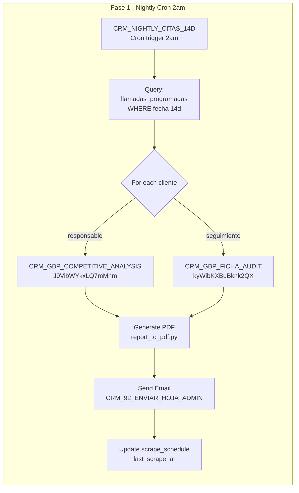

# Diagrama 4: Mapa de WFs n8n

**Total**: 228 workflows  
**Activos**: ~200  
**Dominios**: 15

## Resumen por Dominio

| Dominio | WFs | Activos | Key WFs |
|---------|-----|---------|----------|
| Auth & Users | 18 | 16 | CRM_LOGIN_*, CRM_USUARIOS_* |
| Leads | 14 | 12 | CRM_DISTRIBUIDOR_CAMPANAS, CRM_LANDING_DIGITAL_LEAD_NUEVO |
| Result Registration | 2 | 2 | **CRM_REGISTRAR_RESULTADO** ⭐ |
| Calls & Callbacks | 7 | 7 | CRM_CALLBACKS_*, CRM_LLAMADA_ACTIVA_FIX |
| Agenda | 3 | 3 | **CRM_AGENDA_V2** ⭐, CRM_35/36_POST_* |
| Campaigns | 14 | 11 | CRM_CAMPANAS_*, CRM_DISTRIBUIDOR_* |
| Clients & Cartera | 12 | 11 | **CRM_CARTERA_GET_V4** ⭐, CRM_CLIENTE_* |
| Sales & Contracts | 9 | 9 | CRM_CONTRATO_*, CRM_VENTAS |
| Invoicing | 4 | 4 | CRM_FACTURA_* |
| GBP | 12 | 11 | **CRM_GBP_COMPETITIVE_ANALYSIS** ⭐, CRM_GBP_FICHA_* |
| Scraper | 6 | 6 | CRM_SCRAPER_*, CRM_XIAOMI_COOKIES_* |
| Reputation & KPIs | 4 | 4 | **CRM_KPI_DASHBOARD_V2** ⭐, CRM_BACKFILL_REPUTACION |
| Emails & Outreach | 6 | 5 | CRM_PULSO_*, CRM_82_SEGUIMIENTO_* |
| Proformas | 8 | 8 | CRM_PROFORMA_* |
| Admin | 15 | 13 | CRM_BACKUP_*, CRM_AUDIT_*, CRM_HEALTH_CHECK |

⭐ = **WF crítico para Fase 1**

## Diagrama por Dominio

```mermaid
graph TB
    subgraph Auth["🔐 AUTH & USERS (18 WFs)"]
        A1[CRM_LOGIN]
        A2[CRM_LOGIN_V4]
        A3[CRM_LOGIN_PROD]
        A4[CRM_LOGIN_CODE_V2]
        A5[CRM_LOGIN_ONE_CODE]
        A6[CRM_USUARIOS_LISTA]
        A7[CRM_USUARIOS_CREAR]
        A8[CRM_USUARIOS_EDITAR]
        A9[CRM_USUARIOS_ELIMINAR]
        A10[CRM_USUARIOS_ACTIVAR_2FA]
        A11[CRM_USUARIOS_VERIFICAR_2FA]
        A12[CRM_USUARIOS_DESACTIVAR_2FA]
        A13[CRM_USUARIOS_OBLIGAR_2FA]
        A14[CRM_USUARIOS_DESOBLIGAR_2FA]
        A15[CRM_RESET_PASSWORD]
        A16[SEND_RESET_EMAIL]
        A17[CRM_LOGIN_VARS]
        A18[CRM_04_LOGIN]
    end

    subgraph Leads["📥 LEADS (14 WFs)"]
        L1[CRM_LANDING_DIGITAL_LEAD_NUEVO]
        L2[EMERGENCIA_Lead_Captura]
        L3[CRM_DISTRIBUIDOR_CAMPANAS]
        L4[CRM_DISTRIBUIDOR_HUERFANOS]
        L5[CRM_DISTRIBUIDOR_TRAINING_CRON]
        L6[CRM_LEADS_DISPONIBLES]
        L7[CRM_LEADS_DISPONIBLES_V2]
        L8[CRM_LEADS_LANDING_FINAL]
        L9[CRM_LEADS_HUERFANOS]
        L10[CRM_LEAD_DETAIL]
        L11[CRM_UPDATE_LEAD]
        L12[CRM_LEAD_TIMELINE]
        L13[CRM_WATCHDOG_HUERFANAS_V2]
        L14[CRM_CHECK_LEADS]
    end

    subgraph Result["🎯 RESULT REGISTRATION (2 WFs)"]
        R1[CRM_REGISTRAR_RESULTADO<br/>⭐ BRANCH VENTA → cliente]
        R2[CRM_02_REGISTRAR_RESULTADO_V2]
    end

    subgraph Calls["📞 CALLS & CALLBACKS (7 WFs)"]
        C1[CRM_CALLBACKS_OPERADOR]
        C2[CRM_CALLBACKS_HOY]
        C3[CRM_TOMAR_CALLBACK]
        C4[CRM_CALLBACKS_GESTIONAR]
        C5[CRM_WATCHDOG_CALLBACKS_V2]
        C6[CRM_LLAMADA_ACTIVA_FIX]
        C7[CRM_CLEANUP_LLAMADAS_STUCK]
        C8[CRM_CLEANUP_LLAMADAS_STUCK_V2]
    end

    subgraph Agenda["📅 AGENDA (3 WFs)"]
        G1[CRM_AGENDA_V2<br/>⭐ Reads llamadas_programadas]
        G2[CRM_35_POST_CREAR_CITA]
        G3[CRM_36_POST_ACTUALIZAR_CITA]
    end

    subgraph Campaigns["📣 CAMPAIGNS (14 WFs)"]
        P1[CRM_CAMPANAS_CRUD]
        P2[CRM_CAMPANA_CREAR]
        P3[CRM_CAMPANA_CREAR_DESDE_BUSQUEDA]
        P4[CRM_CAMPANA_ASIGNAR_OPERADORES]
        P5[CRM_CAMPANA_WA_MASIVA]
        P6[CRM_CAMPANA_WA_OPTOUT]
        P7[CRM_CAMPANAS_ELIMINAR]
        P8[CRM_CAMPANAS_ACTIVAS_V2]
        P9[CRM_CAMPANAS_DASHBOARD]
        P10[CRM_CAMPANAS_VERIFICAR_CONFLICTOS]
        P11[CRM_CREAR_CAMPANA_CON_LEADS]
        P12[CRM_CAMPANA_RESULTADOS]
        P13[CRM_CAMPANA_FINALIZAR]
        P14[CRM_CAMPANAS_EXISTENTES]
        P15[CRM_CAMPANA_UPDATE_FIX]
    end

    subgraph Clients["👥 CLIENTS & CARTERA (12 WFs)"]
        CL1[CRM_CARTERA_GET_V4<br/>⭐ Get all active clients]
        CL2[CRM_49_CLIENTE_CREAR]
        CL3[CRM_CLIENTE_GESTOR_ASIGNAR]
        CL4[CRM_CLIENTE_PROXIMA_ACCION]
        CL5[CRM_CLIENTE_BAJA]
        CL6[CRM_CLIENTE_WEB]
        CL7[CRM_CLIENTE_BYBUSINESS_URL<br/>⚠️ STUB - no-op]
        CL8[CRM_CLIENTE_GOOGLE_PLACE_ID]
        CL9[CRM_42_REGISTRAR_INTERACCION]
        CL10[CRM_INTERACCION_EDITAR]
        CL11[CRM_INTERACCION_BORRAR]
        CL12[CRM_CLIENTES_FIX]
    end

    subgraph Sales["💰 SALES & CONTRACTS (9 WFs)"]
        S1[CRM_VENTAS]
        S2[CRM_91_CREAR_HOJA_VENTA]
        S3[CRM_CONTRATOS_DIGITALES]
        S4[CRM_CONTRATOS_DIGITALES_ALL]
        S5[CRM_CONTRATO_CREAR]
        S6[CRM_CONTRATO_ACTUALIZAR]
        S7[CRM_CONTRATO_PREFIRMAR]
        S8[CRM_CONTRATO_FIRMAR]
        S9[CRM_CONTRATO_ENVIAR_EMAIL]
    end

    subgraph GBP["🏪 GBP / GOOGLE BUSINESS (12 WFs)"]
        GB1[CRM_GBP_COMPETITIVE_ANALYSIS<br/>⭐ Competitive report]
        GB2[CRM_INFORME_COMPETENCIA_V4]
        GB3[CRM_INFORME_COMPETENCIA_V6]
        GB4[CRM_INFORME_COMPETENCIA_V7]
        GB5[CRM_INFORME_PDF_V8]
        GB6[CRM_GBP_FICHA_AUDIT]
        GB7[CRM_GBP_FICHA_AUDIT_DAILY_CRON]
        GB8[CRM_GBP_FICHAS_CLIENTE]
        GB9[CRM_GBP_HISTORICO_CLIENTE]
        GB10[CRM_GBP_CAPTURE_PLACE_ID_BATCH]
        GB11[CRM_GBP_AUDIT_DRIFT_GET]
        GB12[CRM_GBP_ALERTAS_GET]
        GB13[CRM_GBP_ALERTAS_EMAIL]
        GB14[CRM_GBP_ALERTAS_RESOLVE]
        GB15[CRM_GBP_ALERTAS_ACK]
        GB16[CRM_GBP_FICHA_SAVE_HISTORY]
        GB17[CRM_GBP_FICHA_HISTORIAL]
        GB18[CRM_GBP_FICHA_SECTOR_GET_CORS]
        GB19[CRM_GBP_EXTRACT_PLACE_ID_FROM_URL]
    end

    subgraph Scraper["🤖 SCRAPER / XIAOMI (6 WFs)"]
        SC1[CRM_SCRAPER_CONFIG_GET]
        SC2[CRM_SCRAPER_CONFIG_UPDATE]
        SC3[CRM_SCRAPER_HEALTH]
        SC4[CRM_XIAOMI_COOKIES_STATUS_GET]
        SC5[CRM_XIAOMI_COOKIES_UPLOAD]
        SC6[CRM_XIAOMI_COOKIES_EXPIRY_CHECK]
    end

    subgraph KPIs["📊 REPUTATION & KPIs (4 WFs)"]
        K1[CRM_KPI_DASHBOARD_V2<br/>⭐ 90d contactabilidad]
        K2[CRM_REPUTACION_LEAD]
        K3[CRM_REPUTACION_LEAD_V2]
        K4[CRM_REPUTACION_LEAD_V3]
        K5[CRM_BACKFILL_REPUTACION]
        K6[CRM_OPERADOR_KPI_LIVE]
        K7[CRM_LEAD_FRESHNESS_METRICS]
    end

    subgraph Emails["📧 EMAILS & OUTREACH (6 WFs)"]
        E1[CRM_80_ENVIAR_INFO_LEAD]
        E2[CRM_82_SEGUIMIENTO_EMAILS_V2]
        E3[CRM_92_ENVIAR_HOJA_ADMIN]
        E4[CRM_PULSO_WA_MASIVA]
        E5[CRM_PULSO_COWORKING_V2]
        E6[CRM_PULSO_RESPUESTAS_V2]
        E7[CRM_PULSO_RESPUESTAS_RECEPTOR]
    end

    subgraph Proformas["📋 PROFORMAS (8 WFs)"]
        PF1[CRM_PROFORMA_SOLICITAR]
        PF2[CRM_PROFORMA_VERIFICAR]
        PF3[CRM_PROFORMA_ENVIAR]
        PF4[CRM_PROFORMA_CONSOLIDAR]
        PF5[CRM_PROFORMA_APROBAR]
        PF6[CRM_PROFORMA_EDITAR]
        PF7[CRM_PROFORMA_REABRIR]
        PF8[CRM_PROFORMA_LINEA]
        PF9[CRM_19_POST_PROFORMA]
    end

    subgraph Admin["⚙️ ADMIN (15 WFs)"]
        AD1[CRM_BACKUP_AUTOMATICO]
        AD2[CRM_BACKUP_RESTORE]
        AD3[CRM_BACKUP_STATUS]
        AD4[CRM_AUDITORIA_LLAMADAS_FIX]
        AD5[CRM_ADMIN_AUDIT_GET]
        AD6[CRM_93_ADMINS_LISTA]
        AD7[CRM_HEALTH_CHECK]
        AD8[CRM_99_CLEANUP_V2]
        AD9[CRM_ACTIVIDAD_OPERADORES_FIX]
        AD10[CRM_GESTOR_CONFIG_FIXED]
        AD11[CRM_GESTOR_CONFIG_UPDATE]
        AD12[CRM_GESTOR_PENDIENTES_V2]
        AD13[CRM_FRONTEND_ERROR_REPORT]
        AD14[CRM_EVENTO_SISTEMA1]
        AD15[CRM_TIMELINE_CLIENTE_COMPLETO]
    end
```



## WFs Críticos para Fase 1 (detalle)



## WFs con Suscripción a Tablas DB

| WF | ID | Tablas | Trigger |
|----|----|----|---------|
| CRM_REGISTRAR_RESULTADO | 6x0x8DCOBzZf62K6 | operaciones.leads, clientes.clientes | webhook |
| CRM_AGENDA_V2 | dqj7YNrXBLZvyt86 | operaciones.llamadas_programadas | webhook |
| CRM_CARTERA_GET_V4 | EWmFKMHx3slciElA | clientes.clientes | webhook |
| CRM_GBP_COMPETITIVE_ANALYSIS | J9VibWYkxLQ7mMhm | clientes.entorno_competitivo | webhook |
| CRM_KPI_DASHBOARD_V2 | LH7nUGlnkhNBEtHo | — | webhook |
| CRM_INFORME_COMPETENCIA_V4 | 2o5aXuUx00MTZgPJ | — | webhook |

## WFs Escaparate (No CRM)

| WF | ID | Proyecto |
|----|----|----------|
| ESCAPARATE_COM_AsistenteWeb_CapturaLead | 77CsA8lNgfmjeWq8 | Escaparate COM |
| ESCAPARATE_COM_Cliente_Existente | 9wlSTMSFLzsc5dzk | Escaparate COM |
| ESCAPARATE_COM_Cliente_Nuevo_V3_COMPLETO | ALIlEPgXCiYq9TQs | Escaparate COM |
| SOFIA_WEB_Chat_V3_Escaparate | uREGQFNeJmf5xEfq | Escaparate |

## Convenciones de Naming

```
CRM_{NN}_{ACCION}     — Numered actions (CRM_35_POST_CREAR_CITA)
CRM_{MODULO}_{ACCION}  — Module actions (CRM_GBP_COMPETITIVE_ANALYSIS)
CRM_LOGIN*            — Auth flows
00_Receptor_*         — Escaparate webhooks
EMERGENCIA_*          — Emergency capture flows
```
