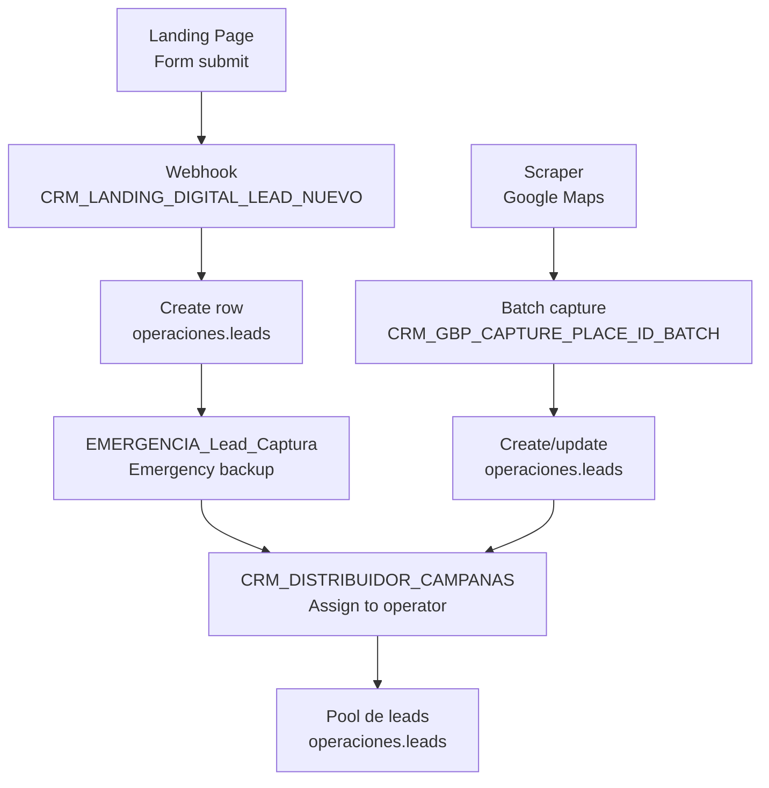
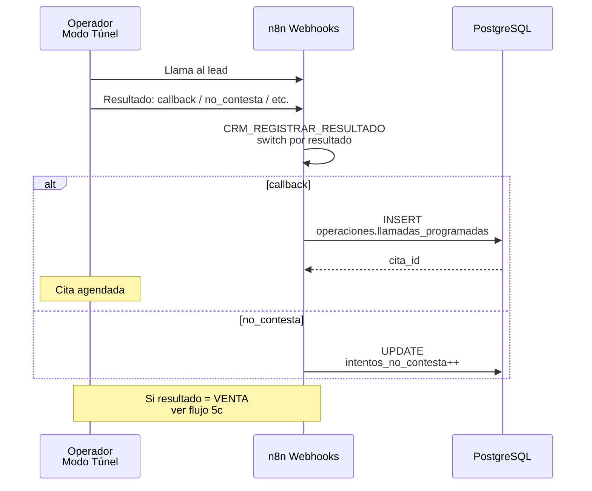
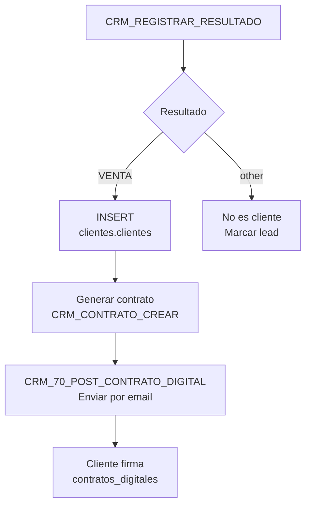
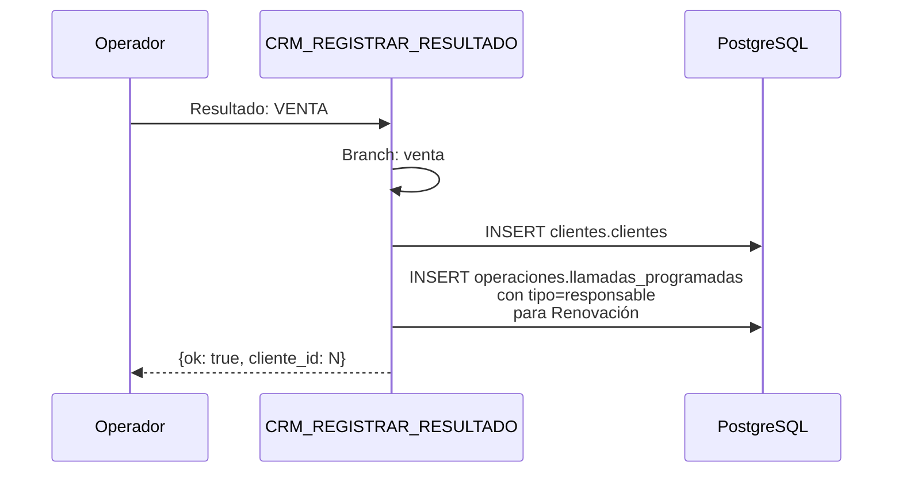
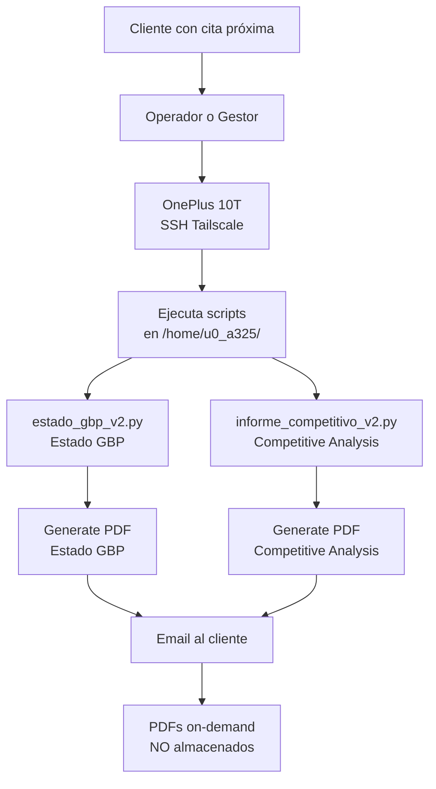
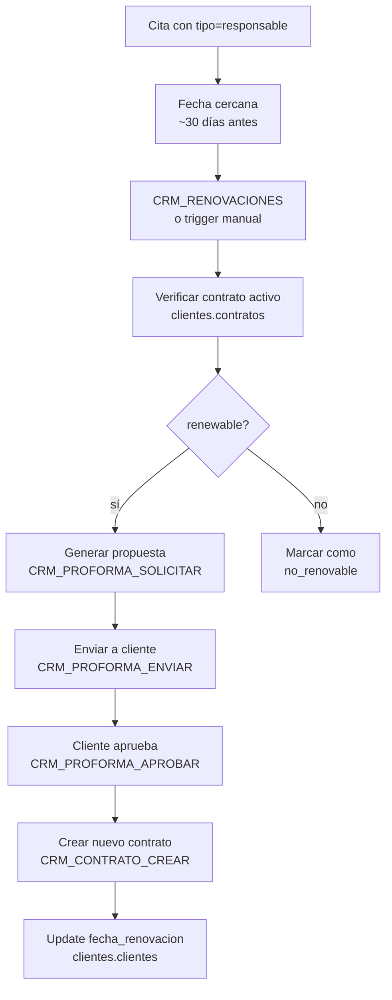
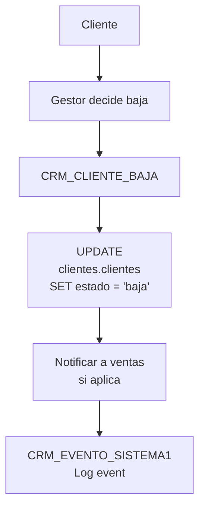

# Diagrama 5: Flujos E2E del Negocio

## Sub-flujo 5a: Captación → Lead



## Sub-flujo 5b: Lead → Cita



```mermaid
flowchart TD
    A[Operador en Modo Túnel] --> B[CRM_REGISTRAR_RESULTADO]
    B --> C{Resultado}
    
    C -->|callback| D[CRM_35_POST_CREAR_CITA]
    D --> E[INSERT<br/>operaciones.llamadas_programadas<br/>tipo: responsable|seguimiento]
    E --> F[Email confirmación<br/>si configurado]
    
    C -->|no_contesta| G[intentos++]
    C -->|enviar_info| H[CRM_80_ENVIAR_INFO_LEAD]
    C -->|no_interes| I[Estado = no_interes]
```

## Sub-flujo 5c: Lead → Cliente (Venta)





## Sub-flujo 5d: Cliente → Informe (Manual OnePlus)



```sql
-- Query para detectar clientes con cita 14d
SELECT c.id, c.nombre_comercial, c.email, 
       lp.tipo, lp.fecha_programada
FROM clientes.clientes c
JOIN operaciones.llamadas_programadas lp ON lp.cliente_id = c.id
WHERE lp.fecha_programada BETWEEN NOW() AND NOW() + INTERVAL '14 days'
  AND lp.estado = 'pendiente'
ORDER BY lp.fecha_programada;
```

## Sub-flujo 5e: Cita → Renovación



## Sub-flujo 5f: Cliente → Baja



## Sub-flujo 5g: Fase 1 — Propuesta WF Nightly

```mermaid
flowchart TB
    subgraph Nightly["Fase 1 - WF Nightly 2am (PROPUESTA)"]
        direction TB
        N1[CRON trigger<br/>2:00 AM] --> N2[Query:<br/>llamadas_programadas<br/>WHERE fecha 5-14d<br/>AND estado=pendiente]
        
        N2 --> N3{For each cliente<br/>con cita}
        N3 -->|tipo=responsable| N4[CRM_GBP_COMPETITIVE_ANALYSIS<br/>J9VibWYkxLQ7mMhm]
        N3 -->|tipo=seguimiento| N5[CRM_GBP_FICHA_AUDIT<br/>kyWibKXBuBknk2QX]
        
        N4 --> N6[estado_gbp_v2.py]
        N5 --> N6
        N6 --> N7[report_to_pdf.py<br/>Generate PDF]
        
        N7 --> N8[Email con PDF<br/>CRM_92_ENVIAR_HOJA_ADMIN]
        N8 --> N9[UPDATE<br/>clientes.scrape_schedule<br/>last_scrape_at = NOW()]
        
        N3 -->|ya scrapeado<br/>últimos 7d| N10[Skip<br/>no re-scrape]
    end
```

```sql
-- Detecta clientes listos para scrape + informe
SELECT 
  c.id as cliente_id,
  c.nombre_comercial,
  c.email,
  c.place_id,
  lp.tipo,
  lp.fecha_programada,
  ss.last_scrape_at,
  CASE 
    WHEN ss.last_scrape_at IS NULL THEN TRUE
    WHEN ss.last_scrape_at < NOW() - INTERVAL '7 days' THEN TRUE
    ELSE FALSE
  END as needs_scrape
FROM operaciones.llamadas_programadas lp
JOIN clientes.clientes c ON c.id = lp.cliente_id
LEFT JOIN clientes.scrape_schedule ss ON ss.cliente_id = c.id
WHERE lp.fecha_programada BETWEEN NOW() AND NOW() + INTERVAL '14 days'
  AND lp.estado = 'pendiente'
  AND lp.es_simulacion = false
ORDER BY lp.fecha_programada ASC;
```

## Resumen de Flujos

| Flujo | Fuente | Destino | WFs Involucrados |
|-------|--------|---------|------------------|
| 5a: Captación | Landing/Scraper | operaciones.leads | CRM_LANDING_DIGITAL_LEAD_NUEVO |
| 5b: Lead → Cita | operador | llamadas_programadas | CRM_REGISTRAR_RESULTADO, CRM_35_POST_CREAR_CITA |
| 5c: Lead → Cliente | operador | clientes.clientes | CRM_REGISTRAR_RESULTADO (branch VENTA) |
| 5d: Cliente → Informe | OnePlus manual | Email + PDF | estado_gbp_v2.py, informe_competitivo_v2.py |
| 5e: Cita → Renovación | cron/gestor | contratos | CRM_RENOVACIONES |
| 5f: Cliente → Baja | gestor | clientes.clientes | CRM_CLIENTE_BAJA |
| 5g: Fase 1 (propuesta) | cron 2am | Email + scrape_schedule | CRM_GBP_COMPETITIVE_ANALYSIS, report_to_pdf.py |

## Decisiones Arquitectónicas Aplicadas

1. **PDFs on-demand** → Flujo 5d y 5g: los PDFs se generan y envían, NO se almacenan
2. **OnePlus = scraper** → Flujo 5d: el scraping ocurre en el OnePlus 10T via SSH
3. **Contactabilidad 90d** → KPI Dashboard usa 90 días, no 30
