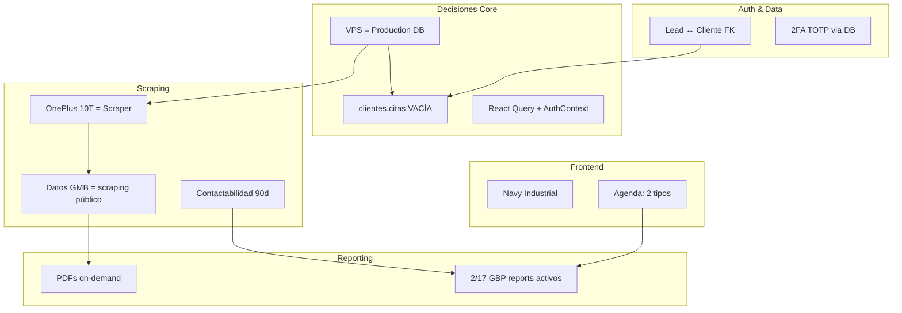

# Diagrama 6: Decisiones Arquitectónicas Vigentes

**NO cambiar sin SDD formal**

## Tabla de Decisiones

| # | Decisión | Motivo | Referencia |
|---|----------|--------|------------|
| 1 | OnePlus 10T = scraper único | Celular físico con Termux ejecuta los scripts de scraping. No restaurar Docker Nano/Heavy. | `crm/infraestructura-oneplus` |
| 2 | PDFs on-demand (no almacenar) | PDFs son regenerables desde datos en DB. Almacenar = breach de decisión. | `crm/arquitectura-pdfs-on-demand` |
| 3 | Lead ↔ Cliente por FK `cliente_id` | Migration 2026-08-23 populate `operaciones.llamadas_programadas.cliente_id` | `crm/fuentes-de-datos-vps-vs-local` |
| 4 | Contactabilidad 90 días | Scrapers caídos desde ~2026-05-09, reputacion_at stale. Umbral ampliado temporalmente. | `crm/mental-map-completo` |
| 5 | VPS = production DB | DB local `postgres-crm` es histórica/stale. Production data solo en VPS. | `crm/scope-solo-vps` |
| 6 | `clientes.citas` VACÍA → usar `operaciones.llamadas_programadas` | Tabla existe pero nunca se populó. Fuente real es `llamadas_programadas` con 564 rows. | `crm/agenda-citas-tipos-2026-08-24` |
| 7 | Agenda con 2 tipos: `responsable` y `seguimiento` | `responsable` = reunión con decisor (renovaciones). `seguimiento` = control. | `crm/agenda-citas-tipos-2026-08-24` |
| 8 | Datos GMB = scraping público | No usar GBP API oficial. Scraping público de Google Maps via OnePlus. | `crm/mental-map-completo` |
| 9 | Navy Industrial en frontend | bg-slate-950, rounded-sm, #D00000, JetBrains Mono para datos. | `AGENTS.md` |
| 10 | Auth 2FA TOTP vía DB function | `auth.verify_totp()` — no usar servicio externo. | `crm/mental-map-completo` |
| 11 | Estado frontend: React Query + AuthContext | No Zustand/Redux. React Query para server state, AuthContext para user state. | `crm/mental-map-completo` |
| 12 | Tablas legacy `gbp_*` abandonadas en local | Renombradas a `gmaps_*` en VPS. Local solo para compatibilidad, no migrar. | `crm/mental-map-completo` |
| 13 | 2/17 GBP reports activos | Solo Estado GBP e Informe Competitivo activos. Otros 15 dormant. | `crm/mental-map-completo` |

## Diagrama de Dependencias



## Decisiones con Fecha de Vencimiento

| Decisión | Temporal | Vencimiento | Condición |
|----------|----------|-------------|-----------|
| Contactabilidad 90d | ✅ Sí | Cuando scrapers restaurados | `reputacion_at` actualizado + backfill completo |
| `clientes.citas` vacía | ✅ Sí | Cuando se migre agenda | Migration planificada |

## Decisiones que Bloquean Features

| Feature | Bloqueada por | Alternativa |
|---------|--------------|-------------|
| Informes automáticos Fase 1 | D2 (PDFs on-demand) | WF genera y envía, no persiste |
| Reportes de renovación | D7 (tipos agenda) | Usar `tipo=responsable` |
| KPI por contactabilidad | D4 (90d) | Volver a 30d post-backfill |

## Anti-patterns Heredados

| Anti-pattern | Prohibido por |
|--------------|---------------|
| Asumir DB local = producción | D5 (VPS = Production DB) |
| Almacenar PDFs en disco | D2 (PDFs on-demand) |
| Usar `clientes.citas` para agenda | D6 (usar llamadas_programadas) |
| Hardcodear IPs o credenciales | AGENTS.md |
| Usar `console.log` en producción | AGENTS.md |

## Referencias a Decisiones en Engram

```
crm/mental-map-completo        → Decisiones 1, 3, 4, 5, 6, 7, 8, 9, 10, 11, 12, 13
crm/infraestructura-oneplus     → Decisión 1
crm/arquitectura-pdfs-on-demand → Decisión 2
crm/agenda-citas-tipos-2026-08-24 → Decisiones 6, 7
crm/scope-solo-vps             → Decisión 5
```
