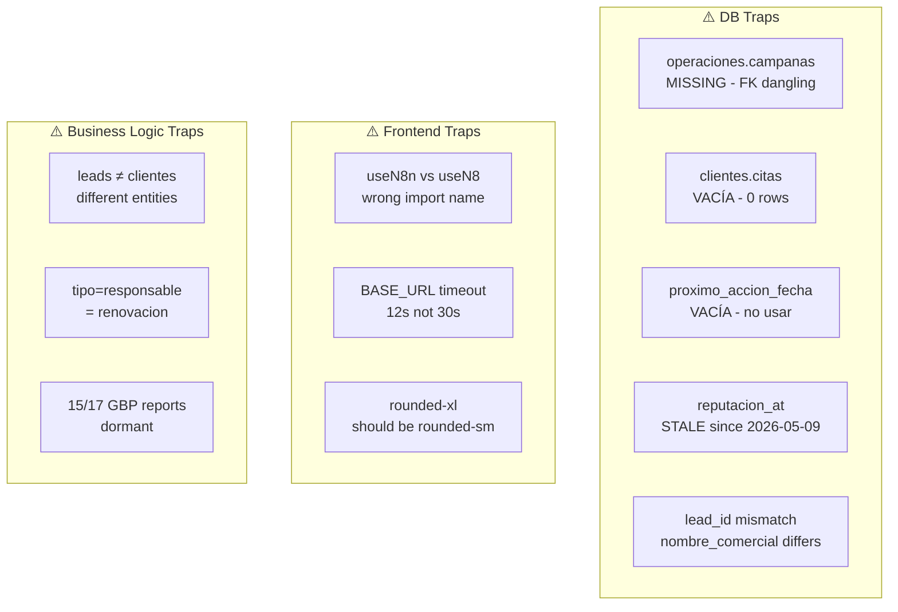

# Diagrama 7: Anti-patterns y Gotchas

## Anti-patterns del Proyecto

### ❌ NO Hacer — Código

| Anti-pattern | Correcto | Referencia |
|-------------|----------|------------|
| Asumir nombres de tablas/columnas sin verificar | Consultar `information_schema` | AGENTS.md |
| Asumir DB local = producción | Usar `postgres-vps` (VPS) | `crm/scope-solo-vps` |
| Asumir sinónimos de campos | "renovación" = `responsable` en agenda | `crm/agenda-citas-tipos-2026-08-24` |
| Empezar operaciones sin bootstrap | Cargar contexto engram primero | `crm/session-bootstrap-convention` |
| Modificar código sin entender arquitectura | Leer `exploration.md` + `AGENTS.md` | AGENTS.md |
| Crear archivos en `/opt/fabrica/` raíz | Usar `/opt/fabrica/CRM_ByBusiness/` | AGENTS.md |
| Hardcodear IPs, credenciales, paths | Usar variables de entorno | AGENTS.md |
| Usar `console.log` en producción | Usar logger wrapper o `console.warn` | AGENTS.md |
| Hacer DDL/DML masivo via MCP | Usar psql directo | AGENTS.md |
| `setTimeout` sin `clearTimeout` | Usar refs para cleanup | AGENTS.md |
| Spinners circulares | Skeleton screens | AGENTS.md |
| `rounded-xl` o `rounded-full` | `rounded-sm` | Navy Industrial |

### ❌ NO Hacer — DB

| Anti-pattern | Problema | Gotcha |
|-------------|----------|--------|
| Usar `postgres-crm` para runtime | DB local vacía/stale | Production = `postgres-vps` |
| Usar `clientes.citas` para agenda | Tabla VACÍA (0 rows) | Usar `operaciones.llamadas_programadas` |
| Confundir `leads` con `clientes` | Diferentes entidades | `leads` = prospectos, `clientes` = compradores |
| Confundir `responsable` con `seguimiento` | Distinto propósito | `responsable` = decisor/renovación |
| Usar `proximo_accion_fecha` | Campo VACÍO | No usar para scheduling |
| Confiar en `reputacion_at` | Datos STALE desde 2026-05-09 | Scrapers caídos |
| Asumir que `operaciones.campanas` existe | **MISSING** — FK dangling | No existe tabla en DB |

### ❌ NO Hacer — Frontend

| Anti-pattern | Correcto |
|-------------|----------|
| Componentes >150 líneas | Split en sub-componentes |
| Sin PropTypes/JSDoc | Agregar desde el primer commit |
| `console.log` en código | Usar `console.warn` o logger |
| Mock data | No usar en producción |
| Fallbacks localhost | Usar variables de entorno |
| Inline styles | Usar Tailwind classes |

## Gotchas Conocidas

### DB: FKs y Tablas

```sql
-- ⚠️ GOTCHA: operaciones.campanas NO EXISTE
-- Esto fallará:
SELECT * FROM operaciones.leads WHERE campana_id = 1;
-- Error: relation "operaciones.campanas" does not exist

-- ⚠️ GOTCHA: clientes.citas está VACÍA
-- Esto retornará 0 rows:
SELECT * FROM clientes.citas;
-- 0 rows

-- ⚠️ GOTCHA: reputacion_at está STALE
SELECT COUNT(*) FROM operaciones.leads 
WHERE reputacion_at > '2026-05-09';
-- 0 rows (scrapers caídos)
```

### DB: Nombres de Campos

```sql
-- ⚠️ GOTCHA: "renovación" aquí es tipo='responsable'
SELECT * FROM operaciones.llamadas_programadas 
WHERE tipo = 'responsable';
-- ↑ Esto retorna las citas de renovación

-- ⚠️ GOTCHA: "seguimiento" es otro tipo
SELECT * FROM operaciones.llamadas_programadas 
WHERE tipo = 'seguimiento';
-- ↑ Llamadas de control
```

### Frontend: Nombres de Variables

```javascript
// ⚠️ GOTCHA: el hook es useN8n, NO useN8
import { useN8n } from './hooks/useN8n'; // ❌
import { useN8nQuery, useN8nMutation } from './hooks/useN8n'; // ✅

// ⚠️ GOTCHA: BASE_URL tiene timeout de 12s
const BASE_URL = import.meta.env.VITE_N8N_URL;
// n8nFetch timeout = 12_000ms
```

### n8n: Workflows

```yaml
# ⚠️ GOTCHA: CRM_CLIENTE_BYBUSINESS_URL es STUB
name: CRM_CLIENTE_BYBUSINESS_URL
# Retorna {ok: true} pero no hace nada real
# ⚠️ NO confiar en que actualice el campo bybusiness_url

# ⚠️ GOTCHA: 2/17 GBP reports activos
reports_dormant:
  - Local SEO Audit
  - Resumen ejecutivo
  - Sentiment individual
  - ... (15 total dormant)
```

## Trampas de la Migration 2026-08-23

```sql
-- ⚠️ TRAMPA: La FK cliente_id se populó vía trigger
-- El trigger sync_llamada_cliente_id() hace match por nombre_comercial
-- Si el nombre no coincide exactamente, cliente_id será NULL

-- Para verificar:
SELECT id, lead_id, cliente_id, nombre_comercial 
FROM operaciones.llamadas_programadas 
WHERE cliente_id IS NULL;
-- Si hay filas, el trigger no pudo hacer match

-- ⚠️ TRAMPA: El trigger usa nombre_comercial
-- Lead: "KOK MORALES VELASCO SL"
-- Cliente: "KOK MORALES VELASCO S.L."
-- ⚠️ No hace match por diferencias menores (SL vs S.L.)
```

## Mapa de Trampas



## Reglas de Supervivencia

1. **Siempre verificar con `information_schema`** antes de asumir nombres
2. **Siempre usar `postgres-vps`** para production data
3. **Nunca usar `clientes.citas`** — siempre `operaciones.llamadas_programadas`
4. **Siempre verificar FKs** — algunas apuntan a tablas que no existen
5. **Siempre hacer bootstrap** — cargar engram antes de operar
6. **Nunca hardcodear** — usar variables de entorno

## Referencias

- Anti-patterns completos: `AGENTS.md` sección "Anti-patterns (NO hacer)"
- Gaps del sistema: `crm/mental-map-completo` → "Gaps Identified"
- Decisiones vigentes: `06_decisiones_arquitectonicas.md`
