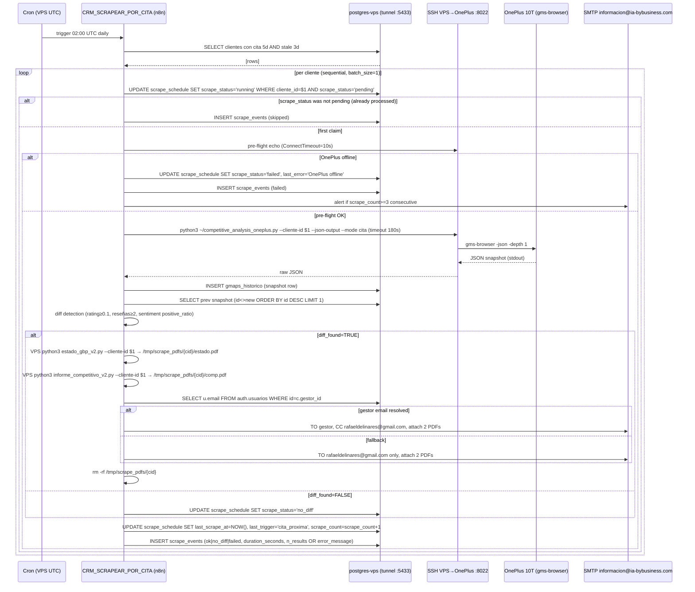

# Design: fase-1-scraping-por-cita

## Architecture Overview



`CRM_MANTENIMIENTO_SCRAPE` (03:00 UTC, LIMIT 10, `--mode mantenimiento`, no diff/email) reuses the same skeleton with branches 14/15/18/19 removed.

---

## Component Breakdown

### C1: DDL Migration (applied via `psql` direct, NOT via MCP)

`postgres-vps` is READ-ONLY (per AGENTS.md anti-pattern #9). Migration runs locally and traverses the existing `tunnel-postgres-vps.service` to `127.0.0.1:5433`.

```sql
-- File: scripts/gbp/migrations/2026-08-24_fase1_scraping.sql
-- Idempotent: safe to re-run. Apply via:
--   PGPASSWORD='Fabrica_Industrial_2026_Secure!' psql -U rafael_admin -h 127.0.0.1 -p 5433 -d crm_bybusiness -f 2026-08-24_fase1_scraping.sql

ALTER TABLE clientes.scrape_schedule
  ADD COLUMN IF NOT EXISTS next_scrape_at   TIMESTAMP WITH TIME ZONE,
  ADD COLUMN IF NOT EXISTS scrape_count     INTEGER DEFAULT 0,
  ADD COLUMN IF NOT EXISTS scrape_status    VARCHAR(20) DEFAULT 'pending',
  ADD COLUMN IF NOT EXISTS last_error       TEXT,
  ADD COLUMN IF NOT EXISTS last_trigger     VARCHAR(50);

CREATE TABLE IF NOT EXISTS clientes.scrape_events (
  id               SERIAL PRIMARY KEY,
  cliente_id       INTEGER,
  triggered_at     TIMESTAMP WITH TIME ZONE DEFAULT NOW(),
  trigger_type     VARCHAR(50),
  scrape_status    VARCHAR(20),
  duration_seconds INTEGER,
  error_message    TEXT,
  n_results        INTEGER
);

CREATE INDEX IF NOT EXISTS idx_scrape_events_cliente    ON clientes.scrape_events(cliente_id);
CREATE INDEX IF NOT EXISTS idx_scrape_events_triggered  ON clientes.scrape_events(triggered_at DESC);
CREATE INDEX IF NOT EXISTS idx_scrape_schedule_status   ON clientes.scrape_schedule(scrape_status);
```

**Verified pre-state**: `scrape_schedule` currently has only `cliente_id PK FK→clientes(id)` + `last_scrape_at DEFAULT now()`. `gmaps_historico` already has the 19 columns needed for diff (`gmaps_rating`, `gmaps_reseñas`, `gmaps_sentiment`, `raw_json`, `fecha_snapshot`). `operaciones.leads` is NOT touched (Refresh-Leads trigger is out of scope per spec).

### C2: WF `CRM_SCRAPEAR_POR_CITA` (Cron 02:00 UTC)

| # | Node | n8n type | Key config |
|---|------|----------|-----------|
| 1 | `Cron 02:00 UTC` | `Schedule Trigger` | cron: `0 2 * * *`, timezone: `UTC` |
| 2 | `Query Cita Proxima` | `Postgres` | REQ-001 query (below) |
| 3 | `Loop por Cliente` | `Split In Batches` | batch_size: 1, sequential; reset after each |
| 4 | `Mark Running (CAS)` | `Postgres` | `UPDATE scrape_schedule SET scrape_status='running' WHERE cliente_id={{$json.id}} AND scrape_status='pending'`; check `rowsAffected` |
| 5 | `Was Pending?` | `IF` | `rowsAffected==0` → branch to `Log Skipped` + next batch |
| 6 | `Pre-flight SSH` | `Execute Command` (ssh) | `ssh -o ConnectTimeout=10 -i /root/.ssh/id_vps_to_oneplus -p 8022 u0_a325@100.89.189.113 echo OK` |
| 7 | `Pre-flight OK?` | `IF` | on non-zero exit → `Mark Failed OnePlus Offline` + `Log Scrape Event` + next |
| 8 | `Scrape via SSH` | `Execute Command` (ssh) | `python3 ~/competitive_analysis_oneplus.py --cliente-id {{$json.id}} --json-output --mode cita` (timeout 180s, capture stdout/stderr) |
| 9 | `Parse JSON Snapshot` | `Code` (JS) | JSON.parse(stdout); extract `gmaps_rating`, `gmaps_reseñas`, `gmaps_sentiment`, `raw_json` |
| 10 | `Insert Snapshot` | `Postgres` | INSERT `clientes.gmaps_historico` (cliente_id, fecha_snapshot=CURRENT_DATE, gmaps_rating, gmaps_reseñas, gmaps_sentiment, raw_json, fuente='oneplus-ssh', tipo_revision='completa') |
| 11 | `Query Prev Snapshot` | `Postgres` | `SELECT gmaps_rating, gmaps_reseñas, gmaps_sentiment FROM clientes.gmaps_historico WHERE cliente_id=$1 AND id<>$new_id ORDER BY id DESC LIMIT 1` |
| 12 | `Diff Detection` | `Code` (JS) | per C6 below; returns `{diff_found, diff_detail}` |
| 13 | `Diff Found?` | `IF` | true → cascade branch (14a/b–19); false → `Mark No Diff` |
| 14a | `Gen PDF Estado GBP` | `Execute Command` | `python3 /opt/fabrica/CRM_ByBusiness/scripts/gbp/estado_gbp/estado_gbp_v2.py --cliente-id {{$json.id}}` (runs on VPS, reads DB via tunnel) |
| 14b | `Gen PDF Informe Competitivo` | `Execute Command` | `python3 /opt/fabrica/CRM_ByBusiness/scripts/gbp/competitive/informe_competitivo_v2.py --cliente-id {{$json.id}}` (VPS) |
| 15 | `Read PDFs as Binary` | `Read Binary Files` | paths: `/tmp/scrape_pdfs/{{$json.id}}/estado_gbp_*.pdf`, `/tmp/scrape_pdfs/{{$json.id}}/informe_competitivo_*.pdf` (or per-script output paths) |
| 16 | `Lookup Gestor Email` | `Postgres` | `SELECT u.email FROM clientes.clientes c LEFT JOIN auth.usuarios u ON u.id=c.gestor_id WHERE c.id={{$json.id}}` |
| 17 | `Resolve Recipients` | `Code` (JS) | `to = email ?? 'rafaeldelinares@gmail.com'; cc = email ? 'rafaeldelinares@gmail.com' : null` |
| 18 | `Send Email + PDFs` | `Send Email` | SMTP cred `8NbamWrMdRexLNwa`, subject: `[GBP] {{nombre_fiscal}} — cita {{fecha_programada|date}} — {{N}} cambios`, attach both PDFs |
| 19 | `Cleanup PDFs` | `Execute Command` | `rm -rf /tmp/scrape_pdfs/{{$json.id}}` |
| 20 | `Mark OK / No Diff` | `Postgres` | `UPDATE scrape_schedule SET scrape_status='ok'|'no_diff'|'failed', last_scrape_at=NOW(), last_trigger='cita_proxima', scrape_count=scrape_count+1, last_error={{$json.last_error ?? NULL}} WHERE cliente_id={{$json.id}}` |
| 21 | `Insert Scrape Event` | `Postgres` | INSERT `clientes.scrape_events` (cliente_id, trigger_type='cita_proxima', scrape_status, duration_seconds, n_results OR error_message) — exactly one row per attempt |
| 22 | `Check Streak>=3` | `IF` | `status=='failed' AND scrape_count>=3` → alert branch |
| 23 | `Send Alert to rafael` | `Send Email` | to `rafaeldelinares@gmail.com`, subject `[SCRAPE ALERT] Cliente {{id}} falló 3+ corridas consecutivas`, body includes `last_error` |

**REQ-001 SQL (Node 2)**:
```sql
SELECT c.id, c.nombre_fiscal, c.gestor_id, lp.fecha_programada, lp.tipo
FROM clientes.clientes c
JOIN operaciones.llamadas_programadas lp ON lp.cliente_id = c.id
LEFT JOIN clientes.scrape_schedule s ON s.cliente_id = c.id
WHERE c.estado = 'activo'
  AND lp.estado = 'pendiente'
  AND lp.fecha_programada BETWEEN NOW() AND NOW() + interval '5 days'
  AND (s.last_scrape_at IS NULL OR s.last_scrape_at < NOW() - interval '3 days')
ORDER BY lp.fecha_programada ASC;
```

### C3: WF `CRM_MANTENIMIENTO_SCRAPE` (Cron 03:00 UTC, LIMIT 10)

Same skeleton as C2 with these substitutions:
- Node 2 query: REQ-008 (below), `LIMIT 10`.
- Node 8 SSH command: `--mode mantenimiento` (skips rank queries — ficha only, ~30% faster).
- **Skip entirely**: nodes 11–19 (no diff, no PDFs, no email).
- Node 21 `trigger_type='mantenimiento'`.
- Node 20 `last_trigger='mantenimiento'`.

**REQ-008 SQL (Node 2)**:
```sql
SELECT c.id, c.nombre_fiscal, s.last_scrape_at,
       EXTRACT(DAY FROM NOW() - s.last_scrape_at) AS dias_sin_scrape
FROM clientes.clientes c
LEFT JOIN clientes.scrape_schedule s ON s.cliente_id = c.id
WHERE c.estado = 'activo'
  AND (s.scrape_status IS NULL OR s.scrape_status = 'pending')
  AND c.id NOT IN (
    SELECT cliente_id FROM operaciones.llamadas_programadas
    WHERE estado='pendiente' AND fecha_programada BETWEEN NOW() AND NOW() + interval '14 days'
  )
  AND (s.last_scrape_at IS NULL OR s.last_scrape_at < NOW() - interval '30 days')
ORDER BY s.last_scrape_at ASC NULLS FIRST
LIMIT 10;
```

### C4: SSH VPS → OnePlus (one-time setup)

1. **Generate ed25519 on VPS host**: `ssh-keygen -t ed25519 -f /root/.ssh/id_vps_to_oneplus -N "" -C "n8n-vps-to-oneplus-2026-08-24"`.
2. **SCP pubkey to OnePlus**: `scp -i /home/rafael/.ssh/id_fabrica -P 8022 /root/.ssh/id_vps_to_oneplus.pub u0_a325@100.89.189.113:~/`.
3. **Authorize on OnePlus** (SSH as `u0_a325`): `cat ~/id_vps_to_oneplus.pub >> ~/.ssh/authorized_keys && chmod 600 ~/.ssh/authorized_keys && rm ~/id_vps_to_oneplus.pub`.
4. **Bind-mount into n8n container**: add to `/opt/fabrica/docker-compose.yml` for service `fabrica-n8n-1` → `volumes: [...] - /root/.ssh/id_vps_to_oneplus:/root/.ssh/id_vps_to_oneplus:ro`; restart container.
5. **n8n SSH credential**: user=`u0_a325`, private key file path=`/root/.ssh/id_vps_to_oneplus` (use n8n credential type "SSH private key" → "File path", not inline text).
6. **Round-trip tests before WF deploy**:
   - From VPS host: `ssh -i /root/.ssh/id_vps_to_oneplus -p 8022 u0_a325@100.89.189.113 echo OK` → must print `OK`.
   - From n8n container: `docker exec fabrica-n8n-1 ssh -i /root/.ssh/id_vps_to_oneplus -p 8022 u0_a325@100.89.189.113 echo OK` → must print `OK`.

**Note**: existing keys at `/home/rafael/.ssh/`: `id_fabrica` (local→OnePlus, used by manual flow), `oneplus10t_ed25519`, `id_rsa`. None of these are on the VPS host; a new VPS-side key is required because the n8n container cannot read `/home/rafael/.ssh/`.

### C5: OnePlus Script Adaptation — `competitive_analysis_oneplus.py` (NEW, thin wrapper)

| Option | Pros | Cons | Choice |
|---|---|---|---|
| **A. Adapt existing `competitive_analysis.py`** | One codebase, fewer files | Coupled to local DSN + filesystem paths + SSH-from-local; refactor risk | Rejected |
| **B. NEW thin wrapper on OnePlus** | Clean JSON stdout; VPS owns DB writes; idempotent | One extra file on OnePlus | **Chosen** |
| **C. Call `gms-browser` directly via SSH** | No wrapper needed | Hardcodes gms-browser args; no ficha scrape (only competitors); loses gms-browser output parsing | Rejected |

The new wrapper at `oneplus/competitive_analysis_oneplus.py` accepts `--cliente-id`, `--json-output`, `--mode {cita,mantenimiento}` and ONLY invokes `gms-browser` with the right query/geo/args, then prints JSON snapshot to stdout. DB persistence, file output, and report generation happen VPS-side.

**Modes**: `cita` = ficha + competitor rank queries (full); `mantenimiento` = ficha only (skips `-results` for competitor query). The wrapper handles the `place_id` → `nombre_fiscal` fallback internally (per spec edge case).

Deployment: `scp -i /home/rafael/.ssh/id_fabrica -P 8022 oneplus/competitive_analysis_oneplus.py u0_a325@100.89.189.113:~/`; `chmod +x` on OnePlus.

### C6: Diff Detection Algorithm (Node 12, JS Code node)

```javascript
// Inputs: prev (null | snapshot), new (snapshot), thresholds
function diff(prev, newS) {
  if (!prev) return { diff_found: true, diff_detail: { reason: 'first_scrape' } };
  const d = {};
  if (prev.gmaps_rating != null && newS.gmaps_rating != null) {
    const delta = Math.abs(newS.gmaps_rating - prev.gmaps_rating);
    if (delta >= 0.1) d.rating_delta = +(newS.gmaps_rating - prev.gmaps_rating).toFixed(2);
  }
  if (prev.gmaps_reseñas != null && newS.gmaps_reseñas != null) {
    const delta = Math.abs(newS.gmaps_reseñas - prev.gmaps_reseñas);
    if (delta >= 2) d.reseñas_delta = newS.gmaps_reseñas - prev.gmaps_reseñas;
  }
  const prevPos = prev.gmaps_sentiment?.positive_ratio;
  const newPos  = newS.gmaps_sentiment?.positive_ratio;
  if (prevPos != null && newPos != null && prevPos !== newPos) d.sentiment_positive_changed = true;
  return { diff_found: Object.keys(d).length > 0, diff_detail: d };
}
```

Threshold summary (per spec REQ-005):
| Field | Meaningful-change threshold |
|---|---|
| `gmaps_rating` | abs(Δ) ≥ 0.1 |
| `gmaps_reseñas` | abs(Δ) ≥ 2 |
| `gmaps_sentiment.positive_ratio` | value changed |

### C7: PDF Generation (VPS-side, online, deleted after email)

| Decision | Options | Tradeoff | Choice |
|---|---|---|---|
| **Generation host** | VPS vs OnePlus | VPS has `weasyprint` deps installed; OnePlus (Termux) lacks libpango/libcairo; SCP-back adds failure mode | **VPS** |
| **Storage** | Persist vs ephemeral | Persist contradicts decision #2 (PDFs on-demand); ephemeral avoids clutter | **Ephemeral, `rm -rf` after Send Email** |
| **Output dir** | Per-cid temp dir | Predictable cleanup; no collision between WFs | `/tmp/scrape_pdfs/{cid}/` |
| **Concurrency** | Sequential per cliente | OnePlus runs single `gms-browser` instance (Termux constraint); also DB write contention | **Sequential, batch_size=1** |

**VPS deps check** (must pass before deploying WFs):
```bash
docker exec fabrica-n8n-1 python3 -c "import psycopg2, weasyprint; print('ok')"
```
If `weasyprint` missing, install in container via custom Dockerfile (`pip install weasyprint psycopg2-binary`) or volume-mount a pre-built venv at `/opt/venv`.

### C8: Email Composition

| Field | Value |
|---|---|
| From | `informacion@ia-bybusiness.com` |
| To | `auth.usuarios.email` JOIN `clientes.clientes.gestor_id` (fallback: `rafaeldelinares@gmail.com`) |
| CC | `rafaeldelinares@gmail.com` (only when gestor resolved) |
| Subject | `[GBP] {nombre_fiscal} — cita {YYYY-MM-DD} — {N} cambios` |
| Body | Plain text: 1-line diff summary (e.g., "Rating 4.2→4.4 (+0.2), Reseñas 47→51 (+4)") + "Adjuntos: Estado GBP + Informe Competitivo v2" |
| Attachments | `estado_gbp_{cid}.pdf`, `informe_competitivo_{cid}.pdf` (binary) |
| SMTP cred ID | `8NbamWrMdRexLNwa` (existing in n8n credentials) |

### C9: Logging & Alerting

**Exactly one `scrape_events` row per attempt**:
```sql
INSERT INTO clientes.scrape_events (cliente_id, trigger_type, scrape_status, duration_seconds, error_message, n_results)
VALUES ({{$json.id}}, {{$json.trigger_type}}, {{$json.status}}, {{$json.duration_seconds}}, {{$json.error ?? null}}, {{$json.n_results ?? null}});
```

**Consecutive-failure alert** (Node 22-23): after each `failed` scrape, the `Mark OK / No Diff` UPDATE returns the new `scrape_count`; if `status=='failed' AND scrape_count>=3`, send a separate alert email to `rafaeldelinares@gmail.com` (NOT the cascade email). Counter resets naturally on first `ok` or `no_diff` (scrape_count is cumulative lifetime, but the streak is implicit via the absence of recent `ok` in `scrape_events` — see "TODO" below).

**Health query** (manual monitoring, not in WF):
```sql
SELECT trigger_type, scrape_status, count(*), round(avg(duration_seconds)) AS avg_sec
FROM clientes.scrape_events
WHERE triggered_at > NOW() - interval '7 days'
GROUP BY 1,2 ORDER BY 1,2;
```

**Open implementation TODO for sdd-tasks**: spec says "counter resets when ok or no_diff achieved" — `scrape_count` is lifetime; streak tracking requires a separate `consecutive_failures` column OR a window query against `scrape_events`. Recommend adding `consecutive_failures INT DEFAULT 0` to `scrape_schedule` (incremented on `failed`, reset to 0 on `ok`/`no_diff`). Flag this to sdd-tasks as a follow-up DDL micro-addition.

---

## Error Handling

| Scenario | Detection | Action |
|---|---|---|
| OnePlus offline | Pre-flight SSH timeout 10s | `UPDATE failed` + INSERT event (status=failed, error='OnePlus offline') + next client |
| SSH scrape timeout | 180s exceeded | `UPDATE failed`, error='SSH timeout' + INSERT event + next client |
| Scraper empty/malformed stdout | Node 9 JSON.parse fails | `UPDATE failed`, error='Empty/malformed JSON from scraper' + INSERT event |
| `gmaps_historico` INSERT fails | Postgres error | `UPDATE failed`, error=exception msg + INSERT event (status=failed) — but `gmaps_historico` not rolled back; manual cleanup needed |
| Email rebound | `Send Email` node error | `UPDATE failed`, error='Email delivery failed'; INSERT event; NO retry same day |
| Cliente sin `place_id` | Handled in OnePlus script via `nombre_fiscal` fallback | No special WF handling |
| Cliente sin gestor email | JOIN returns 0 rows in Node 16 | `to=rafaeldelinares@gmail.com`, `cc=null` |
| WF fired twice same day | Node 4 `rowsAffected==0` | INSERT event (skipped); next client |
| First scrape, no prev snapshot | Node 11 returns 0 rows | `diff_found=TRUE` always |
| Snapshot has NULL gmaps_rating or gmaps_reseñas | Field checks skip that field | Other fields still evaluated |
| `scrape_status='running'` stuck (process crash) | Daily query at 02:00 finds stale `running` | Reset on next cron: implicit (UPDATE doesn't constrain on 'pending'); recommend adding a startup `UPDATE scrape_schedule SET scrape_status='pending' WHERE scrape_status='running' AND last_scrape_at < NOW() - interval '1 hour'` |

---

## Security Considerations

- **SSH key**: ed25519, 0600 perms on VPS host, mounted `:ro` into n8n container, no passphrase (automated cron).
- **DB credentials**: n8n `Postgres` credential type (stored in n8n credential vault, not in WF JSON). The hardcoded `Fabrica_Industrial_2026_Secure!` in scripts is unrelated to n8n DB connection; the n8n container connects via `127.0.0.1:5433` tunnel.
- **SMTP credential**: reuses `8NbamWrMdRexLNwa` (existing).
- **Log scrubbing**: `raw_json` stored as JSONB in `gmaps_historico` (intended — needed for diff context); `scrape_events` does NOT store `raw_json` (only `n_results` and `error_message`).
- **PDF cleanup**: `rm -rf /tmp/scrape_pdfs/{cid}` runs in Node 19 AFTER Send Email returns success (NOT before).
- **SSH `StrictHostKeyChecking=no`**: needed for first connect; mitigate by pre-populating `known_hosts` for `100.89.189.113` on first manual connect.

---

## Performance & Scaling

| Metric | Estimate |
|---|---|
| Per-cliente (Trigger 1, with diff + PDFs + email) | ~3-5 min |
| Per-cliente (Trigger 2, ficha only, no email) | ~2 min |
| Daily Trigger 1 volume | 0-4 clientes (~15 min p95) |
| Daily Trigger 2 volume | 10 clientes (~20 min p95) |
| OnePlus daily load | ~35 min (~3.5 h/week) — within watchdog capacity |
| `scrape_events` growth | ~14 rows/day → ~5,000/year |
| `gmaps_historico` growth | ~14 rows/day × ~2 KB → ~10 MB/year |
| Daily WF window | 02:00–02:20 (Trigger 1) + 03:00–03:20 (Trigger 2), no overlap |
| PDFs on disk at peak | 2 PDFs × 1 cliente mid-flight = <500 KB in `/tmp` |

---

## Migration Plan

| # | Step | Verify |
|---|---|---|
| 1 | Apply DDL via `psql` direct | `\d clientes.scrape_schedule` shows 7 cols; `SELECT 1 FROM clientes.scrape_events LIMIT 0` works |
| 2 | Generate `id_vps_to_oneplus` on VPS host | File exists, perms 0600 |
| 3 | Push pubkey to OnePlus, append to `~/.ssh/authorized_keys` | `ssh -i ... echo OK` from VPS host succeeds |
| 4 | Bind-mount key into `fabrica-n8n-1`, restart | `docker exec fabrica-n8n-1 ssh -i ... echo OK` succeeds |
| 5 | Verify VPS Python deps (`weasyprint`, `psycopg2`, `markdown`) in n8n container | `docker exec ... python3 -c "import weasyprint, psycopg2, markdown"` returns no error |
| 6 | Push `competitive_analysis_oneplus.py` to OnePlus, chmod +x | `--help` runs |
| 7 | Build WF `CRM_SCRAPEAR_POR_CITA` (inactive); manual run with cliente `4` (has cita 2026-08-26) | `scrape_events` has 1 row; `scrape_schedule.last_scrape_at` updated; PDF received at `rafaeldelinares@gmail.com` |
| 8 | Activate `CRM_SCRAPEAR_POR_CITA` | Schedule toggle active; next 02:00 run executes |
| 9 | Build WF `CRM_MANTENIMIENTO_SCRAPE` (inactive); manual run | 10 clientes scraped; no emails sent; `last_trigger='mantenimiento'` |
| 10 | Activate `CRM_MANTENIMIENTO_SCRAPE` | Same as above on cron |
| 11 | Monitor 7 days; daily health query (C9) | No stuck `running`; failure rate <10% |

**Total time**: ~2-3 focused days. **Dependencies**: VPS host SSH access, OnePlus SSH access, n8n credential creation (Postgres + SMTP), `weasyprint` presence on n8n container (largest unknown — may require custom Dockerfile).

---

## Rollback Plan

```sql
-- Rollback DDL (idempotent, safe to re-run)
ALTER TABLE clientes.scrape_schedule DROP COLUMN IF EXISTS next_scrape_at;
ALTER TABLE clientes.scrape_schedule DROP COLUMN IF EXISTS scrape_count;
ALTER TABLE clientes.scrape_schedule DROP COLUMN IF EXISTS scrape_status;
ALTER TABLE clientes.scrape_schedule DROP COLUMN IF EXISTS last_error;
ALTER TABLE clientes.scrape_schedule DROP COLUMN IF EXISTS last_trigger;

DROP TABLE IF EXISTS clientes.scrape_events;
DROP INDEX IF EXISTS idx_scrape_events_cliente;
DROP INDEX IF EXISTS idx_scrape_events_triggered;
DROP INDEX IF EXISTS idx_scrape_schedule_status;
```

**WF rollback**: deactivate both via n8n toggle (do NOT delete — keep inactive for history). Manual scraping (`fill_missing_gbp_v2.py`) remains operational and unaffected.

**SSH key rollback**: on OnePlus: `sed -i '/n8n-vps-to-oneplus-2026-08-24/d' ~/.ssh/authorized_keys`; remove bind-mount from `docker-compose.yml`, restart n8n container; delete `/root/.ssh/id_vps_to_oneplus*` on VPS host.

**Script rollback**: `rm ~/competitive_analysis_oneplus.py` on OnePlus (no data was written by it — all persistence is VPS-side).

---

## Open Questions

- **None blocking** — all 5 spec-phase questions resolved (see `spec.md` Resolved Open Questions).
- **One TODO for sdd-tasks**: confirm whether to add `scrape_schedule.consecutive_failures INT DEFAULT 0` to make the 3-streak alert precise (spec implies it; current schema doesn't track it directly). Decision deferred to sdd-tasks as a micro-DDL addition or workaround via `scrape_events` window query.
