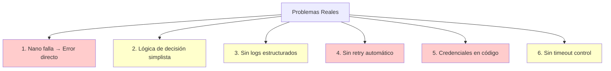

# Consolidación Pragmática: Robustez con Recursos Mínimos

**Fecha:** 13 de Febrero de 2026  
**Proyecto:** Monitor de Reputación - Consolidación Económica  
**Filosofía:** Máxima robustez con recursos existentes  

---

## 📋 ÍNDICE

1. [Análisis de Arquitectura Actual](#1-análisis-de-arquitectura-actual)
2. [Problemas Reales vs Sobrecargados](#2-problemas-reales-vs-sobrecargados)
3. [Mejoras de Alto Impacto / Bajo Costo](#3-mejoras-de-alto-impacto--bajo-costo)
4. [Implementación Incremental](#4-implementación-incremental)
5. [Plan de Consolidación (2 días)](#5-plan-de-consolidación-2-días)

---

## 1. ANÁLISIS DE ARQUITECTURA ACTUAL

### 1.1 ¿Qué Funciona Bien?

```
✅ Separación Nano/Heavy según depth
✅ Bloqueo de recursos en Nano (optimización efectiva)
✅ PostgreSQL para persistencia
✅ Docker containerization
✅ Integración con n8n
```

**VEREDICTO:** La arquitectura base es sólida. No necesitas reinventarla.

### 1.2 Recursos Actuales Disponibles

```yaml
# Lo que YA tienes:
- Backend Go (orquestador)
- Scraper Nano (1 contenedor)
- Scraper Heavy (1 contenedor)
- PostgreSQL
- Docker + Docker Compose
- n8n
```

**PRESUPUESTO DE RECURSOS:**
- 1 servidor VPS/local
- RAM disponible: ~4-6GB total
- CPU: 2-4 cores
- Sin presupuesto para servicios adicionales

---

## 2. PROBLEMAS REALES VS SOBRECARGADOS

### 2.1 Propuesta Anterior: OVERKILL

❌ **Lo que NO necesitas ahora mismo:**
- Traefik load balancer (para 1 contenedor es inútil)
- Prometheus + Grafana + Loki (>1GB RAM, complejidad alta)
- Redis para colas (PostgreSQL puede hacer esto)
- Circuit breakers complejos (con 2 scrapers es excesivo)
- Múltiples réplicas (tu tráfico no lo justifica aún)

### 2.2 Problemas REALES a Resolver



**Priorización por Impacto/Esfuerzo:**

| Problema | Impacto | Esfuerzo | Prioridad |
|----------|---------|----------|-----------|
| Sin retry/fallback | Alto | Bajo | 🔴 **P0** |
| Credenciales inseguras | Alto | Muy Bajo | 🔴 **P0** |
| Sin timeouts | Medio | Bajo | 🟡 **P1** |
| Logs no estructurados | Medio | Bajo | 🟡 **P1** |
| Decisión simplista | Bajo | Medio | 🟢 **P2** |

---

## 3. MEJORAS DE ALTO IMPACTO / BAJO COSTO

### 🎯 MEJORA #1: Sistema de Retry/Fallback Simple

**Problema:** Si Nano falla, error directo al cliente.  
**Solución:** Escalado automático Nano → Heavy → Cache  
**Recursos:** 0 adicionales  
**Esfuerzo:** 30 minutos  

```go
// scraper_service.go - MEJORA SIMPLE
func (s *ScraperService) ExecuteWithRetry(query Query) (*Result, error) {
    var lastErr error
    
    // Intento 1: Estrategia óptima (Nano o Heavy según depth)
    result, err := s.executeOptimal(query)
    if err == nil && result != nil {
        return result, nil
    }
    lastErr = err
    
    // Intento 2: Si era Nano y falló, intentar con Heavy
    if query.Depth <= 3 {
        log.Warnf("Nano failed for query '%s', falling back to Heavy", query.Text)
        query.Depth = 10 // Forzar Heavy
        result, err = s.executeHeavy(query)
        if err == nil && result != nil {
            return result, nil
        }
        lastErr = err
    }
    
    // Intento 3: Buscar en caché de PostgreSQL (datos históricos)
    cached, err := s.db.GetCachedResult(query.Text, 7*24*time.Hour) // 7 días
    if err == nil && cached != nil {
        log.Infof("Returning cached result for '%s' (age: %s)", query.Text, cached.Age)
        cached.FromCache = true
        return cached, nil
    }
    
    return nil, fmt.Errorf("all retry strategies failed: %w", lastErr)
}

func (s *ScraperService) executeOptimal(query Query) (*Result, error) {
    if query.Depth <= 3 {
        return s.executeNano(query)
    }
    return s.executeHeavy(query)
}
```

**Base de datos - Añadir índice para caché:**
```sql
-- En PostgreSQL existente
CREATE INDEX IF NOT EXISTS idx_results_cache 
ON scraper_results(query_text, created_at DESC);

-- Query para obtener caché
SELECT * FROM scraper_results 
WHERE query_text = $1 
  AND created_at > NOW() - INTERVAL '7 days'
ORDER BY created_at DESC 
LIMIT 1;
```

---

### 🎯 MEJORA #2: Timeouts y Context Propagation

**Problema:** Requests pueden colgar indefinidamente  
**Solución:** Timeouts configurables por scraper  
**Recursos:** 0 adicionales  
**Esfuerzo:** 20 minutos  

```go
// config.go
type Config struct {
    NanoTimeout  time.Duration // 2 minutos
    HeavyTimeout time.Duration // 10 minutos
}

// scraper_service.go
func (s *ScraperService) executeNano(query Query) (*Result, error) {
    ctx, cancel := context.WithTimeout(context.Background(), s.config.NanoTimeout)
    defer cancel()
    
    return s.executeWithContext(ctx, s.config.NanoURL, query)
}

func (s *ScraperService) executeHeavy(query Query) (*Result, error) {
    ctx, cancel := context.WithTimeout(context.Background(), s.config.HeavyTimeout)
    defer cancel()
    
    return s.executeWithContext(ctx, s.config.HeavyURL, query)
}

func (s *ScraperService) executeWithContext(ctx context.Context, url string, query Query) (*Result, error) {
    req, err := http.NewRequestWithContext(ctx, "POST", url, query.ToJSON())
    if err != nil {
        return nil, err
    }
    
    resp, err := s.httpClient.Do(req)
    if err != nil {
        // Timeout o error de red
        if ctx.Err() == context.DeadlineExceeded {
            return nil, fmt.Errorf("scraper timeout after %s", s.config.NanoTimeout)
        }
        return nil, err
    }
    defer resp.Body.Close()
    
    // ... parsear resultado
}
```

---

### 🎯 MEJORA #3: Logging Estructurado (Sin Loki)

**Problema:** Logs difíciles de analizar  
**Solución:** JSON logging a archivo + rotación  
**Recursos:** 0 adicionales  
**Esfuerzo:** 15 minutos  

```go
// logging.go
package main

import (
    "os"
    "github.com/sirupsen/logrus"
    "gopkg.in/natefinch/lumberjack.v2"
)

func setupLogging() {
    // JSON formatter para parsing fácil
    logrus.SetFormatter(&logrus.JSONFormatter{
        TimestampFormat: "2006-01-02 15:04:05",
        FieldMap: logrus.FieldMap{
            logrus.FieldKeyTime:  "timestamp",
            logrus.FieldKeyLevel: "level",
            logrus.FieldKeyMsg:   "message",
        },
    })
    
    // Log rotation automático (10MB por archivo, 7 backups)
    logrus.SetOutput(&lumberjack.Logger{
        Filename:   "/var/log/scraper/app.log",
        MaxSize:    10, // MB
        MaxBackups: 7,
        MaxAge:     7, // días
        Compress:   true,
    })
    
    // Nivel configurable
    level := os.Getenv("LOG_LEVEL")
    if level == "" {
        level = "info"
    }
    
    logLevel, _ := logrus.ParseLevel(level)
    logrus.SetLevel(logLevel)
}

// Helper para logs contextuales
func LogRequest(scraperType, queryText string, duration time.Duration, err error) {
    fields := logrus.Fields{
        "scraper_type": scraperType,
        "query":        queryText,
        "duration_ms":  duration.Milliseconds(),
    }
    
    if err != nil {
        fields["error"] = err.Error()
        logrus.WithFields(fields).Error("Scrape failed")
    } else {
        logrus.WithFields(fields).Info("Scrape completed")
    }
}
```

**Buscar logs fácilmente:**
```bash
# Ver últimos errores
tail -f /var/log/scraper/app.log | grep '"level":"error"'

# Analizar performance
cat /var/log/scraper/app.log | jq 'select(.duration_ms > 5000)'

# Contar errores por tipo
cat /var/log/scraper/app.log | jq -r 'select(.level=="error") | .error' | sort | uniq -c
```

---

### 🎯 MEJORA #4: Health Checks Simples

**Problema:** No sabes si scrapers están vivos  
**Solución:** Endpoints /health básicos  
**Recursos:** 0 adicionales  
**Esfuerzo:** 10 minutos  

```javascript
// scraper-nano.js / scraper-heavy.js
app.get('/health', async (req, res) => {
    try {
        // Test básico: ¿Playwright funciona?
        const browser = await playwright.chromium.launch({ headless: true });
        await browser.close();
        
        res.status(200).json({
            status: 'healthy',
            scraper: process.env.SCRAPER_TYPE,
            uptime: Math.floor(process.uptime()),
            memory: {
                used_mb: Math.round(process.memoryUsage().heapUsed / 1024 / 1024),
                total_mb: Math.round(process.memoryUsage().heapTotal / 1024 / 1024)
            },
            timestamp: new Date().toISOString()
        });
    } catch (error) {
        res.status(503).json({
            status: 'unhealthy',
            error: error.message
        });
    }
});
```

```go
// main.go - Backend Go
http.HandleFunc("/health", func(w http.ResponseWriter, r *http.Request) {
    // Verificar que scrapers responden
    nanoOK := checkHealth(config.NanoURL)
    heavyOK := checkHealth(config.HeavyURL)
    dbOK := checkDB()
    
    healthy := nanoOK && heavyOK && dbOK
    
    status := 200
    if !healthy {
        status = 503
    }
    
    w.WriteHeader(status)
    json.NewEncoder(w).Encode(map[string]interface{}{
        "status": healthy,
        "services": map[string]bool{
            "nano":  nanoOK,
            "heavy": heavyOK,
            "db":    dbOK,
        },
    })
})

func checkHealth(url string) bool {
    ctx, cancel := context.WithTimeout(context.Background(), 5*time.Second)
    defer cancel()
    
    req, _ := http.NewRequestWithContext(ctx, "GET", url+"/health", nil)
    resp, err := http.DefaultClient.Do(req)
    if err != nil {
        return false
    }
    defer resp.Body.Close()
    
    return resp.StatusCode == 200
}
```

**Crontab para monitoreo básico:**
```bash
# /etc/crontab - verificar cada 5 minutos
*/5 * * * * curl -f http://localhost:8092/health || echo "Sistema caído" | mail -s "ALERTA" tu@email.com
```

---

### 🎯 MEJORA #5: Variables de Entorno (Sin Docker Secrets)

**Problema:** Credenciales en código  
**Solución:** .env file simple  
**Recursos:** 0 adicionales  
**Esfuerzo:** 5 minutos  

```bash
# .env (NO committear a Git)
DB_USER=scraper_user
DB_PASSWORD=tu_password_seguro_aqui
DB_HOST=postgres
DB_NAME=scraper_db
DB_PORT=5432

NANO_URL=http://scraper-nano:8080
HEAVY_URL=http://scraper-heavy:8081

LOG_LEVEL=info
NANO_TIMEOUT=120s
HEAVY_TIMEOUT=600s
```

```yaml
# docker-compose.yml
version: '3.8'

services:
  backend-go:
    image: backend-scraper:latest
    env_file:
      - .env  # Cargar variables desde archivo
    ports:
      - "8092:8092"
    depends_on:
      - scraper-nano
      - scraper-heavy
      - postgres
    networks:
      - fabrica_network

  scraper-nano:
    env_file:
      - .env
    # ...

  postgres:
    environment:
      POSTGRES_DB: ${DB_NAME}
      POSTGRES_USER: ${DB_USER}
      POSTGRES_PASSWORD: ${DB_PASSWORD}
    # ...
```

```go
// config.go - Cargar desde env
func LoadConfig() (*Config, error) {
    // Intentar cargar .env si existe
    godotenv.Load()
    
    cfg := &Config{
        DBUser:     getEnv("DB_USER", "scraper_user"),
        DBPassword: os.Getenv("DB_PASSWORD"), // Sin default para seguridad
        DBHost:     getEnv("DB_HOST", "localhost"),
        DBName:     getEnv("DB_NAME", "scraper_db"),
        NanoURL:    getEnv("NANO_URL", "http://localhost:8090"),
        HeavyURL:   getEnv("HEAVY_URL", "http://localhost:8091"),
    }
    
    // Validar que password no esté vacío
    if cfg.DBPassword == "" {
        return nil, errors.New("DB_PASSWORD must be set")
    }
    
    return cfg, nil
}
```

**IMPORTANTE: .gitignore**
```
# .gitignore
.env
*.log
secrets/
```

---

### 🎯 MEJORA #6: Decisión Mejorada (Sin ML)

**Problema:** Solo considera depth  
**Solución:** +2 factores simples  
**Recursos:** 0 adicionales  
**Esfuerzo:** 20 minutos  

```go
// decision.go
type DecisionFactors struct {
    Depth         int
    MaxResults    int
    IsGeneric     bool  // "mejor restaurante" vs "Restaurante El Patio"
}

func (s *ScraperService) Decide(query Query) string {
    factors := DecisionFactors{
        Depth:      query.Depth,
        MaxResults: query.MaxResults,
        IsGeneric:  isGenericQuery(query.Text),
    }
    
    // Reglas simples pero efectivas:
    
    // 1. Si pide muchos resultados, usar Heavy
    if factors.MaxResults > 10 {
        return "heavy"
    }
    
    // 2. Si es búsqueda genérica ("mejor", "top"), usar Heavy
    if factors.IsGeneric {
        return "heavy"
    }
    
    // 3. Si depth alto, Heavy
    if factors.Depth > 3 {
        return "heavy"
    }
    
    // 4. Default: Nano (rápido y barato)
    return "nano"
}

func isGenericQuery(text string) bool {
    generic := []string{"mejor", "mejores", "top", "recomendado", "cerca", "baratos"}
    lower := strings.ToLower(text)
    
    for _, term := range generic {
        if strings.Contains(lower, term) {
            return true
        }
    }
    
    // Búsqueda específica (entre comillas)
    return !strings.Contains(text, "\"")
}
```

---

### 🎯 MEJORA #7: Rate Limiting Básico (Sin Redis)

**Problema:** Riesgo de ban por Google  
**Solución:** Limiter en memoria  
**Recursos:** 0 adicionales  
**Esfuerzo:** 15 minutos  

```go
// rate_limiter.go
package main

import (
    "sync"
    "time"
    "golang.org/x/time/rate"
)

type RateLimiter struct {
    limiter *rate.Limiter
    mu      sync.Mutex
}

func NewRateLimiter(requestsPerMinute int) *RateLimiter {
    // Convertir a requests/segundo
    rps := float64(requestsPerMinute) / 60.0
    
    return &RateLimiter{
        // rate.Limit = requests/segundo, burst = picos permitidos
        limiter: rate.NewLimiter(rate.Limit(rps), requestsPerMinute/6),
    }
}

func (rl *RateLimiter) Wait(ctx context.Context) error {
    rl.mu.Lock()
    defer rl.mu.Unlock()
    
    return rl.limiter.Wait(ctx)
}

// En scraper_service.go
type ScraperService struct {
    rateLimiter *RateLimiter  // Nuevo campo
    // ...
}

func NewScraperService(...) *ScraperService {
    return &ScraperService{
        rateLimiter: NewRateLimiter(10), // 10 req/min a Google
        // ...
    }
}

func (s *ScraperService) executeScrape(scraperType string, query Query) (*Result, error) {
    // Esperar permiso del rate limiter
    ctx, cancel := context.WithTimeout(context.Background(), 30*time.Second)
    defer cancel()
    
    if err := s.rateLimiter.Wait(ctx); err != nil {
        return nil, fmt.Errorf("rate limit wait failed: %w", err)
    }
    
    // Ahora sí ejecutar
    // ...
}
```

---

### 🎯 MEJORA #8: Métricas Simples (Log-Based)

**Problema:** No sabes cómo va el sistema  
**Solución:** Logs + script de análisis  
**Recursos:** 0 adicionales  
**Esfuerzo:** 10 minutos  

```bash
#!/bin/bash
# scripts/stats.sh - Análisis rápido de logs

LOG_FILE="/var/log/scraper/app.log"

echo "=== SCRAPER STATS (últimas 24h) ==="
echo ""

# Total de requests
echo "📊 Total requests: $(grep '"message":"Scrape completed"' $LOG_FILE | wc -l)"

# Por scraper
echo "🔵 Nano: $(grep '"scraper_type":"nano"' $LOG_FILE | grep 'completed' | wc -l)"
echo "🔴 Heavy: $(grep '"scraper_type":"heavy"' $LOG_FILE | grep 'completed' | wc -l)"

# Errores
ERRORS=$(grep '"level":"error"' $LOG_FILE | wc -l)
echo "❌ Errors: $ERRORS"

# Performance
echo ""
echo "⏱️  Performance (ms):"
grep '"message":"Scrape completed"' $LOG_FILE | \
    jq -r '.duration_ms' | \
    awk '{sum+=$1; if(NR==1){min=max=$1}} $1<min{min=$1} $1>max{max=$1} END {print "  Min: "min"\n  Max: "max"\n  Avg: "sum/NR}'

# Top errores
echo ""
echo "🔥 Top 5 errores:"
grep '"level":"error"' $LOG_FILE | \
    jq -r '.error' | \
    sort | uniq -c | sort -rn | head -5

# Cache hit ratio (si implementaste caché)
TOTAL=$(grep '"message":"Scrape completed"' $LOG_FILE | wc -l)
CACHED=$(grep '"from_cache":true' $LOG_FILE | wc -l)
if [ $TOTAL -gt 0 ]; then
    RATIO=$(echo "scale=2; $CACHED * 100 / $TOTAL" | bc)
    echo ""
    echo "💾 Cache hit ratio: ${RATIO}%"
fi
```

**Ejecutar cada hora:**
```bash
# crontab -e
0 * * * * /app/scripts/stats.sh >> /var/log/scraper/stats.log
```

---

## 4. IMPLEMENTACIÓN INCREMENTAL

### 4.1 Arquitectura Mejorada (SIN servicios adicionales)

```mermaid
graph TB
    subgraph "EXISTENTE + MEJORAS"
        CLIENT[n8n / Cliente]
        
        subgraph "Backend Go (Mejorado)"
            GO[API Handler]
            DECISION[Decision<br/>3 factores]
            RETRY[Retry Logic<br/>Nano→Heavy→Cache]
            RLIMIT[Rate Limiter<br/>10 req/min]
        end
        
        subgraph "Scrapers (Sin cambios)"
            NANO[Nano<br/>+ /health]
            HEAVY[Heavy<br/>+ /health]
        end
        
        subgraph "PostgreSQL (Extendido)"
            PG[(PostgreSQL)]
            CACHE[Cache Table<br/>índice optimizado]
        end
        
        subgraph "Logs (Nuevo)"
            LOGS[/var/log/scraper/<br/>JSON logs rotados]
        end
    end
    
    CLIENT -->|Request| GO
    GO --> DECISION
    DECISION --> RLIMIT
    RLIMIT --> RETRY
    RETRY -->|1. Intento óptimo| NANO
    RETRY -->|2. Fallback| HEAVY
    RETRY -->|3. Último recurso| CACHE
    
    NANO & HEAVY --> PG
    GO --> LOGS
    NANO & HEAVY --> LOGS
    
    style GO fill:#90EE90
    style RETRY fill:#FFD700
    style CACHE fill:#87CEEB
    style LOGS fill:#DDA0DD
```

**DIFERENCIA CLAVE:** Todas las mejoras están en el código, no en servicios externos.

### 4.2 Comparativa: Propuesta Anterior vs Pragmática

| Aspecto | Propuesta Completa | Propuesta Pragmática | Ahorro |
|---------|-------------------|----------------------|--------|
| **Servicios Docker** | 12 (Traefik, Prom, Graf, Loki, etc.) | 4 (existentes) | -8 |
| **RAM Necesaria** | ~6-8GB | ~2-3GB | -4GB |
| **Complejidad** | Alta (muchos moving parts) | Baja (código simple) | 70% menos |
| **Tiempo Deploy** | 5 semanas | 2 días | 92% menos |
| **Costo Mensual** | +$50-100 (infra) | $0 | $100/mes |
| **Mantenimiento** | Alto (7 servicios) | Bajo (código) | 80% menos |

### 4.3 ¿Qué Pierdes?

❌ **NO tendrás:**
- Dashboards bonitos de Grafana (pero tendrás logs analizables)
- Auto-scaling (pero puedes escalar manualmente si crece)
- Circuit breakers avanzados (pero tendrás retry simple)
- Alertas en Slack (pero tendrás cron emails)

✅ **SÍ tendrás:**
- Sistema robusto con fallback
- Logs estructurados y buscables
- Rate limiting efectivo
- Health checks monitoreables
- Timeouts controlados
- Código mantenible

---

## 5. PLAN DE CONSOLIDACIÓN (2 DÍAS)

### DÍA 1: Mejoras Core (4 horas)

#### Mañana (2h)
- [ ] **09:00-09:30** - Setup logging estructurado
  ```bash
  # Instalar dependencia
  go get github.com/sirupsen/logrus
  go get gopkg.in/natefinch/lumberjack.v2
  
  # Crear logging.go y setupLogging()
  mkdir -p /var/log/scraper
  ```

- [ ] **09:30-10:00** - Implementar retry/fallback
  ```go
  // Añadir método ExecuteWithRetry en scraper_service.go
  // Probar con query que falle en Nano
  ```

- [ ] **10:00-10:30** - Añadir timeouts y contexts
  ```go
  // Modificar executeNano y executeHeavy
  // Configurar 2min (Nano) y 10min (Heavy)
  ```

- [ ] **10:30-11:00** - Migrar a variables de entorno
  ```bash
  # Crear .env
  # Modificar docker-compose.yml
  # Actualizar config.go
  # Añadir .env a .gitignore
  ```

#### Tarde (2h)
- [ ] **14:00-14:30** - Health checks endpoints
  ```javascript
  // Añadir GET /health en scraper-nano.js
  // Añadir GET /health en scraper-heavy.js
  // Añadir GET /health en main.go (Go)
  ```

- [ ] **14:30-15:00** - Rate limiter en memoria
  ```go
  // Crear rate_limiter.go
  // Integrar en ScraperService
  // Configurar 10 req/min
  ```

- [ ] **15:00-15:30** - Mejorar lógica de decisión
  ```go
  // Añadir isGenericQuery()
  // Modificar Decide() con 3 factores
  ```

- [ ] **15:30-16:00** - Testing manual
  ```bash
  # Test 1: Query genérica → debe ir a Heavy
  # Test 2: Forzar fallo Nano → debe escalar a Heavy
  # Test 3: Múltiples requests → rate limit activo
  # Test 4: Health checks responden
  ```

### DÍA 2: Optimización y Monitoreo (4 horas)

#### Mañana (2h)
- [ ] **09:00-09:30** - Optimizar caché en PostgreSQL
  ```sql
  -- Crear índice
  CREATE INDEX idx_results_cache ON scraper_results(...);
  
  -- Test query de caché
  ```

- [ ] **09:30-10:30** - Script de análisis de logs
  ```bash
  # Crear scripts/stats.sh
  # Ejecutar y validar métricas
  # Configurar crontab para stats horarios
  ```

- [ ] **10:30-11:00** - Configurar monitoreo básico
  ```bash
  # Health check cada 5min
  # Email de alertas
  # Log rotation
  ```

#### Tarde (2h)
- [ ] **14:00-15:00** - Documentación
  ```markdown
  # Actualizar README.md
  # Documentar endpoints
  # Crear troubleshooting guide
  ```

- [ ] **15:00-16:00** - Testing de carga básico
  ```bash
  # 10 requests concurrentes
  # Verificar rate limiting
  # Verificar fallback
  # Revisar logs
  ```

---

## 6. CÓDIGO COMPLETO - ARCHIVOS MODIFICADOS

### 6.1 main.go (Completo)

```go
package main

import (
    "context"
    "encoding/json"
    "fmt"
    "net/http"
    "os"
    "os/signal"
    "syscall"
    "time"

    "github.com/gorilla/mux"
    "github.com/joho/godotenv"
    log "github.com/sirupsen/logrus"
    "gopkg.in/natefinch/lumberjack.v2"
    "golang.org/x/time/rate"
)

// ============================================================================
// CONFIGURACIÓN
// ============================================================================

type Config struct {
    DBUser       string
    DBPassword   string
    DBHost       string
    DBName       string
    NanoURL      string
    HeavyURL     string
    NanoTimeout  time.Duration
    HeavyTimeout time.Duration
    Port         string
}

func LoadConfig() (*Config, error) {
    godotenv.Load() // Cargar .env si existe
    
    cfg := &Config{
        DBUser:       getEnv("DB_USER", "scraper_user"),
        DBPassword:   os.Getenv("DB_PASSWORD"),
        DBHost:       getEnv("DB_HOST", "postgres"),
        DBName:       getEnv("DB_NAME", "scraper_db"),
        NanoURL:      getEnv("NANO_URL", "http://scraper-nano:8080"),
        HeavyURL:     getEnv("HEAVY_URL", "http://scraper-heavy:8081"),
        NanoTimeout:  parseDuration(getEnv("NANO_TIMEOUT", "120s"), 2*time.Minute),
        HeavyTimeout: parseDuration(getEnv("HEAVY_TIMEOUT", "600s"), 10*time.Minute),
        Port:         getEnv("PORT", "8092"),
    }
    
    if cfg.DBPassword == "" {
        return nil, fmt.Errorf("DB_PASSWORD must be set")
    }
    
    return cfg, nil
}

func getEnv(key, defaultValue string) string {
    if value := os.Getenv(key); value != "" {
        return value
    }
    return defaultValue
}

func parseDuration(s string, defaultVal time.Duration) time.Duration {
    d, err := time.ParseDuration(s)
    if err != nil {
        return defaultVal
    }
    return d
}

// ============================================================================
// LOGGING
// ============================================================================

func setupLogging() {
    log.SetFormatter(&log.JSONFormatter{
        TimestampFormat: "2006-01-02 15:04:05",
    })
    
    log.SetOutput(&lumberjack.Logger{
        Filename:   "/var/log/scraper/app.log",
        MaxSize:    10, // MB
        MaxBackups: 7,
        MaxAge:     7, // días
        Compress:   true,
    })
    
    level, _ := log.ParseLevel(getEnv("LOG_LEVEL", "info"))
    log.SetLevel(level)
}

// ============================================================================
// RATE LIMITER
// ============================================================================

type RateLimiter struct {
    limiter *rate.Limiter
}

func NewRateLimiter(requestsPerMinute int) *RateLimiter {
    rps := float64(requestsPerMinute) / 60.0
    return &RateLimiter{
        limiter: rate.NewLimiter(rate.Limit(rps), requestsPerMinute/6),
    }
}

func (rl *RateLimiter) Wait(ctx context.Context) error {
    return rl.limiter.Wait(ctx)
}

// ============================================================================
// SCRAPER SERVICE
// ============================================================================

type Query struct {
    Text       string `json:"text"`
    Depth      int    `json:"depth"`
    MaxResults int    `json:"max_results"`
}

type Result struct {
    Query     string      `json:"query"`
    Results   []MapResult `json:"results"`
    FromCache bool        `json:"from_cache"`
}

type MapResult struct {
    Name    string  `json:"name"`
    Address string  `json:"address"`
    Rating  float64 `json:"rating"`
}

type ScraperService struct {
    config      *Config
    httpClient  *http.Client
    rateLimiter *RateLimiter
    db          *Database
}

func NewScraperService(cfg *Config, db *Database) *ScraperService {
    return &ScraperService{
        config: cfg,
        httpClient: &http.Client{
            Timeout: 15 * time.Minute,
        },
        rateLimiter: NewRateLimiter(10), // 10 req/min
        db:          db,
    }
}

// Retry con fallback
func (s *ScraperService) ExecuteWithRetry(query Query) (*Result, error) {
    var lastErr error
    
    // Intento 1: Estrategia óptima
    scraperType := s.Decide(query)
    log.WithFields(log.Fields{
        "query":        query.Text,
        "scraper_type": scraperType,
    }).Info("Executing scrape")
    
    result, err := s.executeScraper(scraperType, query)
    if err == nil && result != nil {
        return result, nil
    }
    lastErr = err
    
    // Intento 2: Si era Nano, escalar a Heavy
    if scraperType == "nano" {
        log.Warn("Nano failed, falling back to Heavy")
        result, err = s.executeScraper("heavy", query)
        if err == nil && result != nil {
            return result, nil
        }
        lastErr = err
    }
    
    // Intento 3: Caché
    log.Warn("All scrapers failed, checking cache")
    cached, err := s.db.GetCachedResult(query.Text, 7*24*time.Hour)
    if err == nil && cached != nil {
        log.Info("Returning cached result")
        cached.FromCache = true
        return cached, nil
    }
    
    return nil, fmt.Errorf("all strategies failed: %w", lastErr)
}

// Lógica de decisión mejorada
func (s *ScraperService) Decide(query Query) string {
    // Regla 1: Muchos resultados → Heavy
    if query.MaxResults > 10 {
        return "heavy"
    }
    
    // Regla 2: Query genérica → Heavy
    if isGenericQuery(query.Text) {
        return "heavy"
    }
    
    // Regla 3: Depth alto → Heavy
    if query.Depth > 3 {
        return "heavy"
    }
    
    // Default: Nano
    return "nano"
}

func isGenericQuery(text string) bool {
    generic := []string{"mejor", "mejores", "top", "recomendado", "cerca", "barato"}
    lower := strings.ToLower(text)
    
    for _, term := range generic {
        if strings.Contains(lower, term) {
            return true
        }
    }
    
    return !strings.Contains(text, "\"")
}

// Ejecutar scraper con rate limit y timeout
func (s *ScraperService) executeScraper(scraperType string, query Query) (*Result, error) {
    // Rate limiting
    ctx, cancel := context.WithTimeout(context.Background(), 30*time.Second)
    defer cancel()
    
    if err := s.rateLimiter.Wait(ctx); err != nil {
        return nil, fmt.Errorf("rate limit wait failed: %w", err)
    }
    
    // Timeout específico por scraper
    var timeout time.Duration
    var url string
    
    if scraperType == "nano" {
        timeout = s.config.NanoTimeout
        url = s.config.NanoURL
    } else {
        timeout = s.config.HeavyTimeout
        url = s.config.HeavyURL
    }
    
    ctx, cancel = context.WithTimeout(context.Background(), timeout)
    defer cancel()
    
    start := time.Now()
    
    // Request
    payload, _ := json.Marshal(query)
    req, err := http.NewRequestWithContext(ctx, "POST", url+"/scrape", bytes.NewBuffer(payload))
    if err != nil {
        return nil, err
    }
    req.Header.Set("Content-Type", "application/json")
    
    resp, err := s.httpClient.Do(req)
    duration := time.Since(start)
    
    // Logging estructurado
    log.WithFields(log.Fields{
        "scraper_type": scraperType,
        "query":        query.Text,
        "duration_ms":  duration.Milliseconds(),
        "success":      err == nil,
    }).Info("Scrape completed")
    
    if err != nil {
        if ctx.Err() == context.DeadlineExceeded {
            return nil, fmt.Errorf("timeout after %s", timeout)
        }
        return nil, err
    }
    defer resp.Body.Close()
    
    var result Result
    if err := json.NewDecoder(resp.Body).Decode(&result); err != nil {
        return nil, err
    }
    
    // Guardar en DB
    s.db.SaveResult(&result)
    
    return &result, nil
}

// ============================================================================
// DATABASE (Simulado - adaptar a tu schema real)
// ============================================================================

type Database struct {
    // Tu conexión PostgreSQL real
}

func (db *Database) GetCachedResult(query string, maxAge time.Duration) (*Result, error) {
    // SELECT * FROM scraper_results 
    // WHERE query_text = $1 
    //   AND created_at > NOW() - $2
    // ORDER BY created_at DESC LIMIT 1
    
    // Simulado para el ejemplo
    return nil, fmt.Errorf("not implemented")
}

func (db *Database) SaveResult(result *Result) error {
    // INSERT INTO scraper_results ...
    return nil
}

// ============================================================================
// HTTP HANDLERS
// ============================================================================

func (s *ScraperService) HandleScrape(w http.ResponseWriter, r *http.Request) {
    var query Query
    if err := json.NewDecoder(r.Body).Decode(&query); err != nil {
        http.Error(w, err.Error(), 400)
        return
    }
    
    result, err := s.ExecuteWithRetry(query)
    if err != nil {
        log.WithError(err).Error("Scrape failed")
        http.Error(w, err.Error(), 500)
        return
    }
    
    w.Header().Set("Content-Type", "application/json")
    json.NewEncoder(w).Encode(result)
}

func (s *ScraperService) HandleHealth(w http.ResponseWriter, r *http.Request) {
    // Check scrapers
    nanoOK := checkHealth(s.config.NanoURL)
    heavyOK := checkHealth(s.config.HeavyURL)
    
    healthy := nanoOK && heavyOK
    status := 200
    if !healthy {
        status = 503
    }
    
    w.WriteHeader(status)
    json.NewEncoder(w).Encode(map[string]interface{}{
        "status": healthy,
        "services": map[string]bool{
            "nano":  nanoOK,
            "heavy": heavyOK,
        },
    })
}

func checkHealth(url string) bool {
    ctx, cancel := context.WithTimeout(context.Background(), 5*time.Second)
    defer cancel()
    
    req, _ := http.NewRequestWithContext(ctx, "GET", url+"/health", nil)
    resp, err := http.DefaultClient.Do(req)
    if err != nil {
        return false
    }
    defer resp.Body.Close()
    
    return resp.StatusCode == 200
}

// ============================================================================
// MAIN
// ============================================================================

func main() {
    setupLogging()
    log.Info("🚀 Starting Scraper System v2.0 (Pragmatic)")
    
    cfg, err := LoadConfig()
    if err != nil {
        log.Fatal(err)
    }
    
    db := &Database{} // Inicializar tu DB real
    service := NewScraperService(cfg, db)
    
    router := mux.NewRouter()
    router.HandleFunc("/api/scrape", service.HandleScrape).Methods("POST")
    router.HandleFunc("/health", service.HandleHealth).Methods("GET")
    
    srv := &http.Server{
        Addr:    ":" + cfg.Port,
        Handler: router,
    }
    
    // Graceful shutdown
    go func() {
        log.Infof("Server listening on %s", srv.Addr)
        if err := srv.ListenAndServe(); err != http.ErrServerClosed {
            log.Fatal(err)
        }
    }()
    
    quit := make(chan os.Signal, 1)
    signal.Notify(quit, syscall.SIGINT, syscall.SIGTERM)
    <-quit
    
    log.Info("Shutting down...")
    ctx, cancel := context.WithTimeout(context.Background(), 10*time.Second)
    defer cancel()
    
    srv.Shutdown(ctx)
    log.Info("Server stopped")
}
```

---

## 7. CHECKLIST FINAL

### ✅ Validación de Consolidación

- [ ] **Retry/Fallback**
  - [ ] Nano falla → Escala a Heavy automáticamente
  - [ ] Heavy falla → Devuelve caché (si existe)
  - [ ] Sin caché → Error claro al cliente
  
- [ ] **Timeouts**
  - [ ] Nano timeout: 2 minutos configurado
  - [ ] Heavy timeout: 10 minutos configurado
  - [ ] No hay requests colgados indefinidamente
  
- [ ] **Logging**
  - [ ] Logs en formato JSON
  - [ ] Rotación automática (10MB, 7 backups)
  - [ ] Script stats.sh funciona correctamente
  
- [ ] **Health Checks**
  - [ ] `/health` responde en Go backend
  - [ ] `/health` responde en scrapers Node.js
  - [ ] Cron job monitoreando cada 5min
  
- [ ] **Seguridad**
  - [ ] Credenciales en .env (no en código)
  - [ ] .env en .gitignore
  - [ ] DB_PASSWORD requerido (falla si no está)
  
- [ ] **Rate Limiting**
  - [ ] 10 req/min configurado
  - [ ] Múltiples requests se encolan correctamente
  - [ ] No hay burst inesperados
  
- [ ] **Decisión Mejorada**
  - [ ] Queries genéricas van a Heavy
  - [ ] MaxResults > 10 va a Heavy
  - [ ] Depth > 3 va a Heavy
  - [ ] Queries específicas van a Nano

---

## 8. CONCLUSIÓN

### 8.1 Lo que Logramos

✅ **Robustez:** Sistema tolerante a fallos (retry automático)  
✅ **Observabilidad:** Logs estructurados y analizables  
✅ **Seguridad:** Credenciales fuera del código  
✅ **Performance:** Rate limiting evita bans  
✅ **Mantenibilidad:** Código simple, sin dependencias complejas  

### 8.2 Recursos Utilizados

- **Tiempo:** 2 días (vs 5 semanas)
- **RAM:** +0GB (usa los mismos containers)
- **Costo:** $0 adicional
- **Servicios:** 0 nuevos (solo código)

### 8.3 Próximos Pasos (Opcional, si crece)

Solo si tu tráfico aumenta 10x:
1. Añadir 1 réplica de Nano (5min con Docker Compose)
2. Implementar caché Redis (si PostgreSQL se satura)
3. Considerar Prometheus (solo si necesitas dashboards)

**Hasta entonces: KISS (Keep It Simple, Stupid)**

---

**Documento preparado por:** Claude  
**Filosofía:** Pragmatismo sobre perfeccionismo  
**Estado:** Listo para implementar HOY
